# git使用教程

一些教程文档：

+ git官方文档[中文版](https://git-scm.com/book/zh/v2)

+ https://try.github.io/

+ 一个很好的可视化学习教程https://learngitbranching.js.org/?locale=zh_CN

##一、Git是什么？
Git是目前世界上最先进的**分布式**版本控制系统。那么它就没有中央服务器的，每个人的电脑就是一个完整的版本库，这样，工作的时候就不需要联网了，因为版本都是在自己的电脑上。既然每个人的电脑都有一个完整的版本库，那多个人如何协作呢？比如说自己在电脑上改了文件A，其他人也在电脑上改了文件A，这时，你们两之间只需把各自的修改推送给对方，就可以互相看到对方的修改了。
工作原理 / 流程：


Workspace：工作区
Index / Stage：暂存区
Repository：仓库区（或本地仓库）
Remote：远程仓库

## 二、git安装

git安装配置：

+ 在[git 官网](https://git-scm.com/)下载最新版的git，一路按默认安装即可

  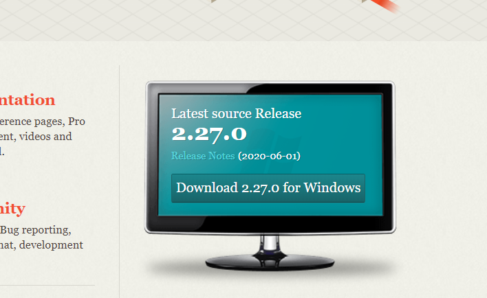

  下载安装完成后还需要最后一步设置，打开git bash

  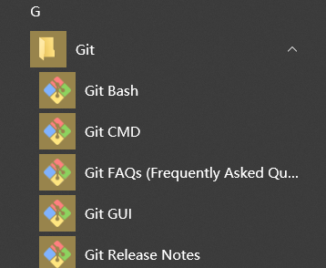

  在命令行分别输入如下你的姓名和邮箱（对应github上的）：

  ```bash
  git config --global user.name "you name"
  git config --global user.email "email@example.com"
  ```

  

+ git图形化推荐软件[github desktop](https://desktop.github.com/)（github官方出品，入门级，现在我在用的） [sourcetree](https://www.sourcetreeapp.com/)（更详细复杂），记得

## 三、基础操作

1. 创建版本库（又叫仓库）

   在你想存放仓库的目录下新建一个文件夹（这个文件夹就是你的仓库）

   然后cd到改目录下输入git init，这时候你当前testgit目录下会多了一个.git的目录，这个目录是Git来跟踪管理版本的，没事千万不要手动乱改这个目录里面的文件，否则，会把git仓库给破坏了。或者一可以在文件夹下右键点击git bash here:

   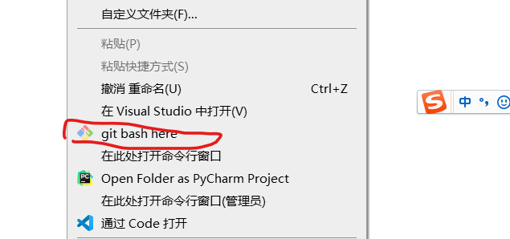

   初始化后：

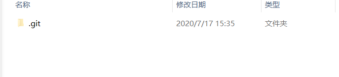

2. 添加文件

   首先要明确下，所有的版本控制系统，只能跟踪文本文件的改动，比如txt文件，网页，所有程序的代码等，Git也不列外，版本控制系统可以告诉你每次的改动，但是图片，视频这些二进制文件，虽能也能由版本控制系统管理，但没法跟踪文件的变化，只能把二进制文件每次改动串起来，也就是知道图片从1kb变成2kb，但是到底改了啥，版本控制也不知道。

   + 使用命令 **git add** readme.txt添加到暂存区里面去（必须是文件夹有这个文件）。如下：

     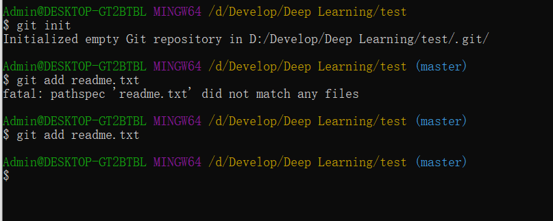

     如果和上面一样，没有任何提示，说明已经添加成功了。

   + 用命令 **git commit**告诉Git，把文件提交到仓库。

     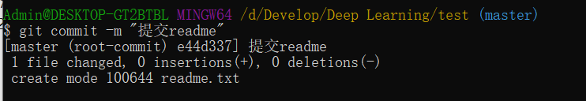

     其中“ ”填的是注释，到现在我们已经提交了一个readme.txt文件了，我们下面可以通过命令**git status**来查看是否还有文件未提交，如下：

     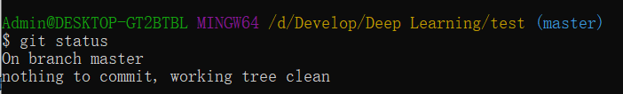

     说明没有任何文件未提交，但我现在修改readme.txt内容，在里面添加一行666666内容并保存，继续使用git status来查看下结果，如下：

     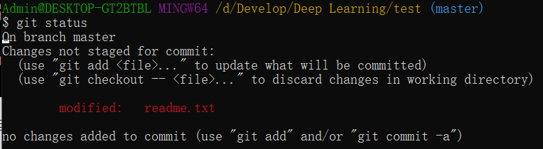

     上面的命令告诉我们 readme.txt文件已被修改，但是未被提交。如果我想看下readme.txt文件到底改了什么内容要查看呢？可以使用如下命令：

     **git diff** readme.txt 如下：

     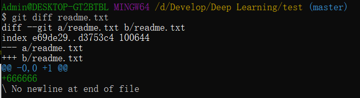

     可以看到，readme.txt文件内容添加了一行666666内容，知道了对readme.txt文件做了什么修改后，我们可以放心的提交到仓库了，

   

因此提交文件是2步：第一步git add xxx 第二步：git commit

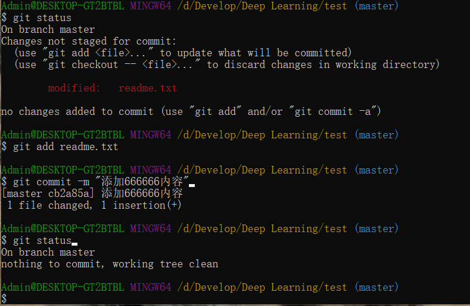

3. 版本回退

   可使用git log来查看下历史记录信息，使用git reflog获取每次操作的版本号，使用git reset --hard 版本号来恢复，具体可自行搜索

4. 工作区与暂存区？

   工作区：就是你在电脑上看到的目录，比如目录下testgit里的文件(.git隐藏目录版本库除外)。或者以后需要再新建的目录文件等等都属于工作区范畴。
   版本库(Repository)：工作区有一个隐藏目录.git，这个不属于工作区，这是版本库。其中版本库里面存了很多东西，其中最重要的就是stage(暂存区)，还有Git为我们自动创建了第一个分支master,以及指向master的一个指针HEAD。

   我们前面说过使用Git提交文件到版本库有两步：

   第一步：是使用 git add 把文件添加进去，实际上就是把文件添加到暂存区。

   第二步：使用git commit提交更改，实际上就是把暂存区的所有内容提交到当前分支上。

   因此，可以git add 提交多个文件，然后只用输入一次git commit就可全部提交。

5. 远程仓库

   如何添加远程库？
   现在的情景是：我们已经在本地创建了一个Git仓库后，又想在github创建一个Git仓库，并且希望这两个仓库进行远程同步，这样github的仓库可以作为备份，又可以其他人通过该仓库来协作。

   首先，登录github上，然后在右上角找到+号，点击“New repository”按钮:

   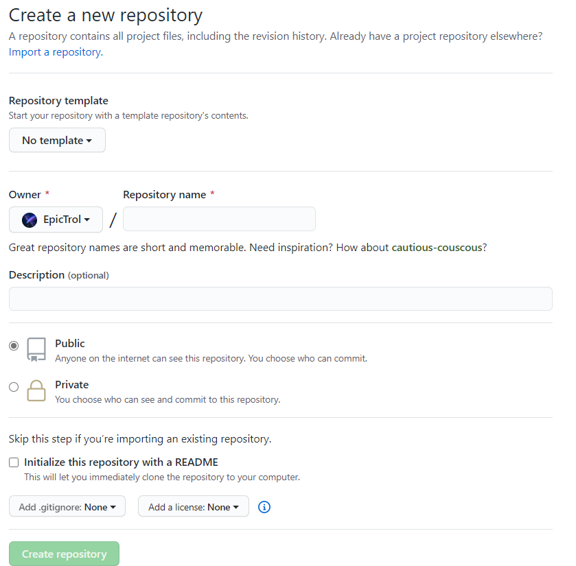

   在Repository name填入仓库名，Description是对这个仓库的描述，Public是公用（即开源，其他人都能看到），Private是私有（别人看不到你的仓库）；Initialize this repository with a README是为你的仓库添加一个readme的说明文件，填完这些信息后就成功创建了一个新的Git仓库

   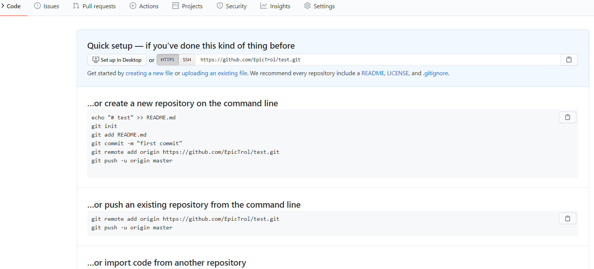

   当然一开始新建的肯定是空的，我们可以把一个已有的本地仓库与之关联，然后，把本地仓库的内容推送到GitHub仓库。根据GitHub的提示，在本地的test仓库下运行命令：

    ```bash
    git remote add origin https://github.com/EpicTrol/test.git
    ```
   
   当然第一次需要你输入账号密码，如果你是用ssh方式的话就不需要每次都输入密码
   
   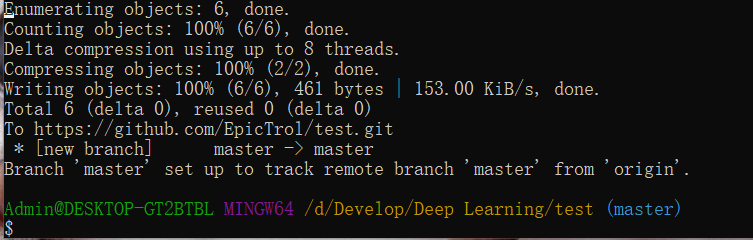
   
   这样就成功了，你也可以在网上找到很多其他的教程去学一学。
   
6. 远程仓库的拉取推送

   当你从远程库克隆时候，实际上Git自动把本地的master分支和远程的master分支对应起来了，并且远程库的默认名称是origin。

   查看远程库的信息：git remote 查看远程库的详细信息：git remote –v

   一：推送分支：

   推送分支就是把该分支上所有本地提交到远程库中，推送时，要指定本地分支，这样，Git就会把该分支推送到远程库对应的远程分支上：

   使用命令 git push origin master

   一般情况下默认都是master分支，所以直接push即可，但注意要先拉取最新的分支git pull（即获取最新的内容）然后才提交自己的更改，否则会产生各种冲突。当然即使先pull然后再push有时也会有各种冲突，这里不展开细讲，可以自行搜索。

## 四、git图形化工具

git图形化推荐软件[github desktop](https://desktop.github.com/)（github官方出品，入门级挺好用的）。clone时点击Open with Github Desktop就会唤起应用打开，具体使用教程网上有很多且较简单，这里展示一下例子（提交修改的文件），commit然后push。

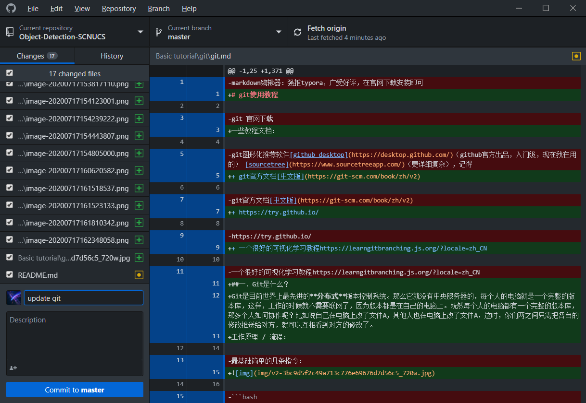

[sourcetree](https://www.sourcetreeapp.com/)（更详细复杂）

## 五、常用命令(看一下就好)

一、新建代码库

+ 在当前目录新建一个Git代码库
  $ git init

+ 新建一个目录，将其初始化为Git代码库
  $ git init [project-name] 下载一个项目和它的整个代码历史

  $ git clone [url]

二、配置

+ 显示当前的Git配置
  $ git config --list

+ 编辑Git配置文件
  $ git config -e [--global] # 设置提交代码时的用户信息
  
  $ git config [--global] user.name "[name]"
  
  $ git config [--global] user.email "[email address]"

三、增加/删除文件

+ 添加指定文件到暂存区
  $ git add [file1] [file2] ... # 添加指定目录到暂存区，包括子目录

  $ git add [dir] # 添加当前目录的所有文件到暂存区

  $ git add . # 添加每个变化前，都会要求确认 # 对于同一个文件的多处变化，可以实现分次提交

  $ git add -p

+ 删除工作区文件，并且将这次删除放入暂存区
  $ git rm [file1] [file2] ... # 停止追踪指定文件，但该文件会保留在工作区

  $ git rm --cached [file] # 改名文件，并且将这个改名放入暂存区

  $ git mv [file-original] [file-renamed]


四、代码提交
+ 提交暂存区到仓库区
  $ git commit -m [message] # 提交暂存区的指定文件到仓库区

  $ git commit [file1] [file2] ... -m [message] # 提交工作区自上次commit之后的变化，直接到仓库区

  $ git commit -a

+ 提交时显示所有diff信息
  $ git commit -v

+ 使用一次新的commit，替代上一次提交 # 如果代码没有任何新变化，则用来改写上一次commit的提交信息
  $ git commit --amend -m [message] # 重做上一次commit，并包括指定文件的新变化

  $ git commit --amend [file1] [file2] ...


五、分支
+ 列出所有本地分支
$ git branch

+ 列出所有远程分支
$ git branch -r

+ 列出所有本地分支和远程分支
$ git branch -a

+ 新建一个分支，但依然停留在当前分支
  $ git branch [branch-name] # 新建一个分支，并切换到该分支

  $ git checkout -b [branch] # 新建一个分支，指向指定commit

  $ git branch [branch] [commit] # 新建一个分支，与指定的远程分支建立追踪关系

  $ git branch --track [branch] [remote-branch] # 切换到指定分支，并更新工作区

  $ git checkout [branch-name] # 切换到上一个分支

  $ git checkout - # 建立追踪关系，在现有分支与指定的远程分支之间

  $ git branch --set-upstream [branch] [remote-branch] # 合并指定分支到当前分支

  $ git merge [branch] # 选择一个commit，合并进当前分支

  $ git cherry-pick [commit] # 删除分支

  $ git branch -d [branch-name] # 删除远程分支

  $ git push origin --delete [branch-name]

  $ git branch -dr [remote/branch]


六、标签
+ 列出所有tag
$ git tag

+ 新建一个tag在当前commit
  $ git tag [tag] # 新建一个tag在指定commit

  $ git tag [tag] [commit] # 删除本地tag

  $ git tag -d [tag] # 删除远程tag

  $ git push origin :refs/tags/[tagName] # 查看tag信息

  $ git show [tag] # 提交指定tag

  $ git push [remote] [tag] # 提交所有tag

  $ git push [remote] --tags

+ 新建一个分支，指向某个tag
  $ git checkout -b [branch] [tag]

七、查看信息
+ 显示有变更的文件
$ git status

+ 显示当前分支的版本历史
$ git log

+ 显示commit历史，以及每次commit发生变更的文件
$ git log --stat

+ 搜索提交历史，根据关键词
  $ git log -S [keyword] # 显示某个commit之后的所有变动，每个commit占据一行

  $ git log [tag] HEAD --pretty=format:%s

+ 显示某个commit之后的所有变动，其"提交说明"必须符合搜索条件
  $ git log [tag] HEAD --grep feature

+ 显示某个文件的版本历史，包括文件改名
  $ git log --follow [file]

  $ git whatchanged [file] # 显示指定文件相关的每一次diff

  $ git log -p [file] # 显示过去5次提交

  $ git log -5 --pretty --oneline

+ 显示所有提交过的用户，按提交次数排序
  $ git shortlog -sn

+ 显示指定文件是什么人在什么时间修改过
  $ git blame [file] # 显示暂存区和工作区的差异

  $ git diff

+ 显示暂存区和上一个commit的差异
  $ git diff --cached [file] # 显示工作区与当前分支最新commit之间的差异

  $ git diff HEAD

+ 显示两次提交之间的差异
  $ git diff [first-branch]...[second-branch] # 显示今天你写了多少行代码

  $ git diff --shortstat "@{0 day ago}" # 显示某次提交的元数据和内容变化

  $ git show [commit] # 显示某次提交发生变化的文件

  $ git show --name-only [commit] # 显示某次提交时，某个文件的内容

  $ git show [commit]:[filename] # 显示当前分支的最近几次提交

  $ git reflog

八、远程同步
+ 下载远程仓库的所有变动
  $ git fetch [remote] # 显示所有远程仓库

  $ git remote -v

+ 显示某个远程仓库的信息
  $ git remote show [remote] # 增加一个新的远程仓库，并命名

  $ git remote add [shortname] [url] # 取回远程仓库的变化，并与本地分支合并

  $ git pull [remote] [branch] # 上传本地指定分支到远程仓库

  $ git push [remote] [branch] # 强行推送当前分支到远程仓库，即使有冲突

  $ git push [remote] --force

+ 推送所有分支到远程仓库
  $ git push [remote] --all

九、撤销
+ 恢复暂存区的指定文件到工作区
  $ git checkout [file] # 恢复某个commit的指定文件到暂存区和工作区

  $ git checkout [commit] [file] # 恢复暂存区的所有文件到工作区

  $ git checkout . # 重置暂存区的指定文件，与上一次commit保持一致，但工作区不变

  $ git reset [file] # 重置暂存区与工作区，与上一次commit保持一致

  $ git reset --hard

+ 重置当前分支的指针为指定commit，同时重置暂存区，但工作区不变
  $ git reset [commit] # 重置当前分支的HEAD为指定commit，同时重置暂存区和工作区，与指定commit一致

  $ git reset --hard [commit] # 重置当前HEAD为指定commit，但保持暂存区和工作区不变

  $ git reset --keep [commit] # 新建一个commit，用来撤销指定commit # 后者的所有变化都将被前者抵消，并且应用到当前分支

  $ git revert [commit] # 暂时将未提交的变化移除，稍后再移入

  $ git stash

  $ git stash pop