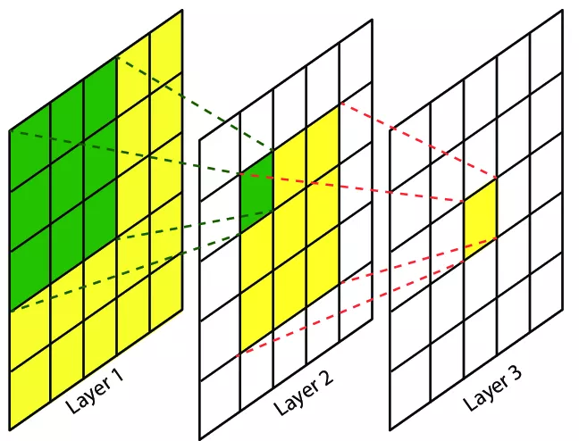
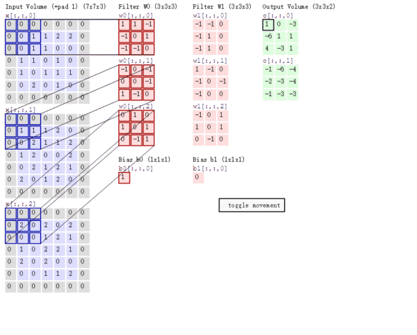
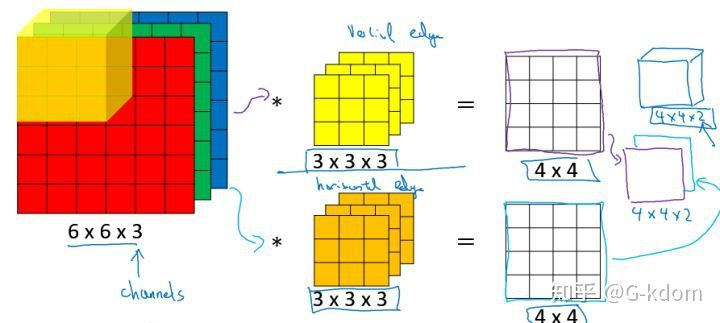
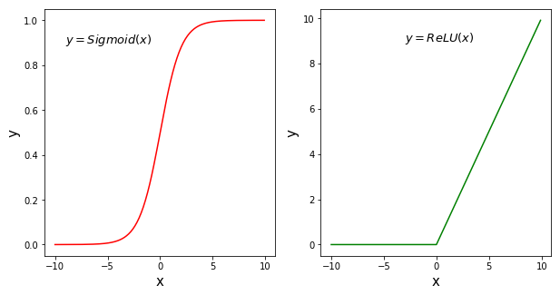
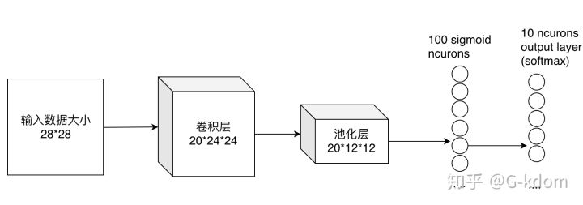

# 深入浅出卷积神经网络CNN

[TOC]

**卷积神经网络（Convolutional Neural Network, CNN）**是一类特殊的人工神经网络，是深度学习中重要的一个分支，是目前计算机视觉中使用最普遍的模型结构。在图像分类时，常常面临着图像大，物体的形态、位置不同等问题，这就给普通的神经网络带来了难题，而CNN就是来解决这个问题，它的精度和速度比传统计算学习算法高很多。特别是在计算机视觉领域，CNN是解决图像分类、图像检索、物体检测和语义分割的主流模型。本章节主要为读者介绍卷积神经网络的一些基础模块和原理以及常见的卷积神经网络模型，包括：

- 卷积（Convolution）
- 池化（Pooling）
- ReLU激活函数
- 批归一化（Batch Normalization）
- 丢弃法（Dropout）

------

## 前序

在传统的手写数字识别任务中我们在网络模型里应用的是一个全连接层的特征提取，即将一张图片上的所有像素点展开成一个1维向量输入网络，但存在如下两个问题：

1. **输入数据的空间信息被丢失**。 空间上相邻的像素点往往具有相似的RGB值，RGB的各个通道之间的数据通常密切相关，但是转化成1维向量时，这些信息被丢失。同时，图像数据的形状信息中，可能隐藏着某种本质的模式，但是转变成1维向量输入全连接神经网络时，这些模式也会被忽略。

2. **模型参数过多，容易发生过拟合**。 在手写数字识别案例中，每个像素点都要跟所有输出的神经元相连接。当图片尺寸变大时，输入神经元的个数会按图片尺寸的平方增大，导致模型参数过多，容易发生过拟合。

为了解决上述问题，我们引入卷积神经网络进行特征提取，既能提取到相邻像素点之间的特征模式，又能保证参数的个数不随图片尺寸变化。一个卷积神经网络由很多层组成，它们的输入是三维的，输出也是三维的，有的层有参数，有的层不需要参数；利用输入图片的特点，卷积神经网络把神经元设计成三个维度 ：width, height, depth。比如输入的图片大小是 32 × 32 × 3 (rgb)，那么输入神经元就也具有 32×32×3 的维度。下图就是一个典型的卷积神经网络结构，多层卷积和池化层组合作用在输入图片上，在网络的最后通常会加入一系列全连接层，ReLU激活函数一般加在卷积或者全连接层的输出上，网络中通常还会加入Dropout来防止过拟合。

------

**说明：**

卷积神经网络每一层由众多的卷积核组成，每个卷积核对输入的像素进行卷积操作，得到下一次的输入。随着网络层的增加卷积核会逐渐扩大感受野，并缩减图像的尺寸。在卷积神经网络中，计算范围是在像素点的空间邻域内进行的，卷积核参数的数目也远小于全连接层。卷积核本身与输入图片大小无关，它代表了对空间邻域内某种特征模式的提取。比如，有些卷积核提取物体边缘特征，有些卷积核提取物体拐角处的特征，图像上不同区域共享同一个卷积核。当输入图片大小不一样时，仍然可以使用同一个卷积核进行操作。

与普通神经网络非常相似，卷积神经网络由具有可学习的权重和偏置常量的神经元组成。每个神经元都接收一些输入，并做一些点积计算，输出是每个分类的分数；卷积神经网络默认输入是图像，可以让我们把特定的性质编码入网络结构，使我们的前馈函数更加有效率，并减少了大量参数。

------

## **卷积神经网络原理结构**

### 卷积（Convolution）

卷积神经网路中每层卷积层由若干卷积单元组成，每个卷积单元的参数都是通过反向传播算法优化得到的。卷积运算的目的是提取输入的不同特征，第一层卷积层可能只能提取一些低级的特征如边缘、线条和角等层级，更多层的网络能从低级特征中迭代提取更复杂的特征。

以灰度图像为例进行讲解：从一个小小的权重矩阵，也就是卷积核（kernel）开始，让它逐步在二维输入数据上“扫描”。卷积核“滑动”的同时，计算权重矩阵和扫描所得的数据矩阵的乘积，然后把结果汇总成一个输出像素。

#### 卷积计算

卷积是数学分析中的一种积分变换的方法，在图像处理中采用的是卷积的离散形式。这里需要说明的是，在卷积神经网络中，卷积层的实现方式实际上是数学中定义的**互相关 （cross-correlation）运算**（与数学分析中的卷积定义有所不同）：将图像矩阵中，从左到右，由上到下，取与滤波器同等大小的一部分，每一部分中的值与滤波器中的值对应相乘后求和，最后的结果组成一个矩阵，其中没有对核进行翻转。具体的计算过程如下：

------

**说明：**

卷积核（kernel）也被叫做滤波器（filter），假设卷积核的高和宽分别为$k_h$和$k_w$，则将称为$k_h\times k_w$卷积，比如$3\times5$卷积，就是指卷积核的高为3, 宽为5。

-----

- 如图（a）所示：左边的图大小是$3\times3$，表示输入数据是一个维度为$3\times3$的二维数组；中间的图大小是$2\times2$，表示一个维度为$2\times2$的二维数组，我们将这个二维数组称为卷积核。先将卷积核的左上角与输入数据的左上角（即：输入数据的(0, 0)位置）对齐，把卷积核的每个元素跟其位置对应的输入数据中的元素相乘，再把所有乘积相加，得到卷积输出的第一个结果

$$
0\times1 + 1\times2 + 2\times4 + 3\times5 = 25  \ \ \ \ \ \ \ (a)
$$

- 如图（b）所示：将卷积核向右滑动，让卷积核左上角与输入数据中的(0,1)位置对齐，同样将卷积核的每个元素跟其位置对应的输入数据中的元素相乘，再把这4个乘积相加，得到卷积输出的第二个结果，

$$
0\times2 + 1\times3 + 2\times5 + 3\times6 = 31  \ \ \ \ \ \ \ (b)
$$

- 如图（c）所示：将卷积核向下滑动，让卷积核左上角与输入数据中的(1, 0)位置对齐，可以计算得到卷积输出的第三个结果，

$$
0\times4 + 1\times5 + 2\times7 + 3\times8 = 43   \ \ \ \ \ \ \ (c)
$$

- 如图（d）所示：将卷积核向右滑动，让卷积核左上角与输入数据中的(1, 1)位置对齐，可以计算得到卷积输出的第四个结果，

$$
0\times5 + 1\times6 + 2\times8 + 3\times9 = 49   \ \ \ \ \ \ \ (d)
$$

卷积核的计算过程可以用下面的数学公式表示，其中 $a$ 代表输入图片， $b$ 代表输出特征图，$w$ 是卷积核参数，它们都是二维数组，$\sum{u,v}{\ }$ 表示对卷积核参数进行遍历并求和。

$$
b[i, j] = \sum_{u,v}{a[i+u, j+v]\cdot w[u, v]}
$$

举例说明，假如上图中卷积核大小是$2\times 2$，则$u$可以取0和1，$v$也可以取0和1，也就是说：
$$b[i, j] = a[i+0, j+0]\cdot w[0, 0] + a[i+0, j+1]\cdot w[0, 1] + a[i+1, j+0]\cdot w[1, 0] + a[i+1, j+1]\cdot w[1, 1]$$

读者可以自行验证，当$[i, j]$取不同值时，根据此公式计算的结果与上图中的例子是否一致。

------

在卷积神经网络中，一个卷积算子除了上面描述的卷积过程之外，还包括加上偏置项的操作。例如假设偏置为1，则上面卷积计算的结果为：

$$
0\times1 + 1\times2 + 2\times4 + 3\times5 \mathbf{\  + 1}  = 26
$$

$$
0\times2 + 1\times3 + 2\times5 + 3\times6 \mathbf{\  + 1} = 32
$$
$$
0\times4 + 1\times5 + 2\times7 + 3\times8 \mathbf{\  + 1} = 44
$$
$$
0\times5 + 1\times6 + 2\times8 + 3\times9 \mathbf{\  + 1} = 50
$$

------

#### 填充（Padding）

在前面的例子中，在上面的例子中，我们输入图片尺寸为$3\times3$，输出图片尺寸为$2\times2$，经过一次卷积之后，图片尺寸变小，为什么会这样呢？我们分别从数学计算和图形化的角度分析：

+ 从图形化的角度看，输入图像与卷积核进行卷积后的结果中损失了部分值，输入图像的边缘被“修剪”掉了（边缘处只检测了部分像素点，丢失了图片边界处的众多信息），这是因为边缘上的像素永远不会位于卷积核中心，而卷积核也没法扩展到边缘区域以外。这个结果我们是不能接受的，有时我们还希望输入和输出的大小应该保持一致。为解决这个问题，可以在进行卷积操作前，对原矩阵进行边界**填充（Padding）**，也就是在矩阵的边界上填充一些值，以增加矩阵的大小，通常都用“$0$”来进行填充的。为了避免卷积之后图片尺寸变小，通常会在图片的外围进行填充(padding)，如图8所示。

  

  
 图：图形填充示例  

+ 从数学计算的角度看，卷积输出特征图的尺寸计算方法如下：

  $$
  H_{out} = H - k_h + 1
  $$

  $$
  W_{out} = W - k_w + 1
  $$

  如果输入尺寸为4，卷积核大小为3时，输出尺寸为$4-3+1=2$（可自行检查当输入图片和卷积核为其他尺寸时，上述计算式是否成立）。在通过多次计算我们发现，当卷积核尺寸大于1时，输出特征图的尺寸会小于输入图片尺寸，说明**经过多次卷积之后尺寸会不断减小**。为了避免卷积之后图片尺寸变小，通常会在图片的外围进行填充(padding)：

  

  
 图：图形填充  

- 如图（a）所示：填充的大小为1，填充值为0。填充之后，输入图片尺寸从$4\times4$变成了$6\times6$，使用$3\times3$的卷积核，输出图片尺寸为$4\times4$。
- 如图（b）所示：填充的大小为2，填充值为0。填充之后，输入图片尺寸从$4\times4$变成了$8\times8$，使用$3\times3$的卷积核，输出图片尺寸为$6\times6$。

如果在图片高度方向，在第一行之前填充$p_{h1}$行，在最后一行之后填充$p_{h2}$行；在图片的宽度方向，在第1列之前填充$p_{w1}$列，在最后1列之后填充$p_{w2}$列；则填充之后的图片尺寸为$(H + p_{h1} + p_{h2})\times(W + p_{w1} + p_{w2})$。经过大小为$k_h\times k_w$的卷积核操作之后，输出图片的尺寸为：
$$
H_{out} = H + p_{h1} + p_{h2} - k_h + 1
$$
$$
W_{out} = W + p_{w1} + p_{w2} - k_w + 1
$$

在卷积计算过程中，通常会在高度或者宽度的两侧采取等量填充，即$p_{h1} = p_{h2} = p_h,\ \ p_{w1} = p_{w2} = p_w$，上面计算公式也就变为：
$$
H_{out} = H + 2p_h - k_h + 1
$$
$$
W_{out} = W + 2p_w - k_w + 1
$$
卷积核大小通常使用1，3，5，7这样的奇数，如果使用的填充大小为$p_h=(k_h-1)/2, p_w=(k_w-1)/2$，则卷积之后图像尺寸不变。例如当卷积核大小为3时，padding大小为1，卷积之后图像尺寸不变；同理，如果卷积核大小为5，使用padding的大小为2，也能保持图像尺寸不变。

常用的两种padding：

**（1）valid padding**：不进行任何处理，只使用原始图像，不允许卷积核超出原始图像边界

**（2）same padding**：进行填充，允许卷积核超出原始图像边界，并使得卷积后结果的大小与原来的一致

------

#### 步长（Stride）

卷积过程中，有时需要通过padding来避免信息损失来保存输出的尺寸等于输入的尺寸，有时也要在卷积时通过设置的**步长（Stride）**来压缩一部分信息，或者使输出的尺寸小于输入的尺寸。在卷积过程（滑动卷积核）时，我们会先从输入的左上角开始，每次往左滑动一列或者往下滑动一行逐一计算输出，我们将**每次滑动的行数和列数**称为**Stride**，在之前的图片中，Stride=1；在下图的两个示例中，Stride=2。

+ 从数学计算的角度：

  当宽和高方向的步幅分别为$s_h$和$s_w$时，输出特征图尺寸的计算公式是：

  $$
  H_{out} = \frac{H + 2p_h - k_h}{s_h} + 1
  $$

  $$
  W_{out} = \frac{W + 2p_w - k_w}{s_w} + 1
  $$

  假设输入图片尺寸是$H\times W = 100 \times 100$，卷积核大小$k_h \times k_w = 3 \times 3$，填充$p_h = p_w = 1$，步幅为$s_h = s_w = 2$，则输出特征图的尺寸为：

  $$
  H_{out} = \frac{100 + 2 - 3}{2} + 1 = 50
  $$

  $$
  W_{out} = \frac{100 + 2 - 3}{2} + 1 = 50
  $$

  

+ Stride的作用：是成倍缩小尺寸，而这个参数的值就是缩小的具体倍数，比如步幅为2，输出就是输入的1/2；步幅为3，输出就是输入的1/3。以此类推。

+ 卷积核的大小一般为奇数\*奇数 ：$1*1$，$3*3$，$5*5$，$7*7$都是最常见的。这是为什么呢？为什么没有偶数*偶数​？

  **（1）更容易padding**

  在卷积时，我们有时候需要卷积前后的尺寸不变。这时候我们就需要用到padding。假设图像的大小，也就是被卷积对象的大小为$n*n$，卷积核大小为$k*k$，padding的幅度设为$(k-1)/2$时，卷积后的输出就为$[n-k+2*((k-1)/2)]/1+1=n$，即卷积输出为$n*n$，保证了卷积前后尺寸不变。但是如果$k$是偶数的话，$(k-1)/2$就不是整数了。

  **（2）更容易找到卷积锚点**

  在CNN中，进行卷积操作时一般会以卷积核模块的一个位置为基准进行滑动，这个基准通常就是卷积核模块的中心。若卷积核为奇数，卷积锚点很好找，自然就是卷积模块中心，但如果卷积核是偶数，这时候就没有办法确定了，让谁是锚点似乎都不怎么好。

------

#### 一些补充

**卷积的计算公式**

**输入图片的尺寸：**一般用 $n * n$ 表示输入的image大小。**卷积核的大小：**一般用 $f*f$ 表示卷积核的大小。

**填充（Padding）：**一般用 $p$来表示填充大小。

**步长(Stride)：**一般用 $s$ 来表示步长大小。

**输出图片的尺寸：**一般用 $o$ 来表示。如果已知  $n$、 $f$ 、  、 $p$、$s$ 可以求得 $o$ ，**计算公式如下：**$o= \lfloor \frac{n+2p-f}{s} \rfloor +1$其中"$\lfloor $ $  \rfloor$"是向下取整符号，用于结果不是整数时进行向下取整。

------

#### 感受野（Receptive Field）

输出特征图上每个点的数值，是由输入图片上大小为$k_h\times k_w$的区域的元素与卷积核每个元素相乘再相加得到的，所以输入图像上$k_h\times k_w$区域内每个元素数值的改变，都会影响输出点的像素值。我们将这个区域叫做输出特征图上对应点的感受野。感受野内每个元素数值的变动，都会影响输出点的数值变化。比如$3\times3$卷积对应的感受野大小就是$3\times3$。

------

#### 多输入通道、多输出通道和批量操作

**多通道卷积**

这里就要涉及到“卷积核”和“filter”这两个术语的区别。在只有一个通道的情况下，“卷积核”就相当于“filter”，这两个概念是可以互换的。但在一般情况下，它们是两个完全不同的概念。**每个“filter”实际上恰好是“卷积核”的一个集合**，在当前层，每个通道都对应一个卷积核，且这个卷积核是独一无二的。

**多通道卷积的计算过程：**将矩阵与滤波器对应的每一个通道进行卷积运算，最后相加，形成一个单通道输出，加上偏置项后，我们得到了一个最终的单通道输出。如果存在多个filter，这时我们可以把这些最终的单通道输出组合成一个总输出。这里我们还需要**注意**一些问题——滤波器的通道数、输出特征图的通道数。

**某一层滤波器的通道数 = 上一层特征图的通道数。**如上图所示，我们输入一张 $6\times6\times3$ 的RGB图片，那么滤波器（$3\times3\times3$）也要有三个通道。

**某一层输出特征图的通道数 = 当前层滤波器的个数。**如上图所示，当只有一个filter时，输出特征图（ ）的通道数为1；当有2个filter时，输出特征图（ $4\times4\times2$）的通道数为2。

前面介绍的卷积计算过程比较简单，实际应用时，处理的问题要复杂的多。例如：在上述例子中都只包含一个输入通道。实际上，大多数输入图像（彩色图片）都有 RGB 3个通道，需要处理多输入通道的场景。输出特征图往往也会具有多个通道，而且在神经网络的计算中常常是把一个批次的样本放在一起计算，所以卷积算子需要具有批量处理多输入和多输出通道数据的功能，下面将分别介绍这几种场景的操作方式。

- **多输入通道场景**

上面的例子中，卷积层的数据是一个2维数组，但实际上一张图片往往含有RGB三个通道，要计算卷积的输出结果，卷积核的形式也会发生变化。假设输入图片的通道数为$C_{in}$，输入数据的形状是$C_{in}\times{H_{in}}\times{W_{in}}$，计算过程如 **图10** 所示。

1. 对每个通道分别设计一个2维数组作为卷积核，卷积核数组的形状是$C_{in}\times{k_h}\times{k_w}$。

1. 对任一通道$c_{in} \in [0, C_{in})$，分别用大小为$k_h\times{k_w}$的卷积核在大小为$H_{in}\times{W_{in}}$的二维数组上做卷积。

1. 将这$C_{in}$个通道的计算结果相加，得到的是一个形状为$H_{out}\times{W_{out}}$的二维数组。

 图10：多输入通道计算过程  

- **多输出通道场景**

一般来说，卷积操作的输出特征图也会具有多个通道$C_{out}$，这时我们需要设计$C_{out}$个维度为$C_{in}\times{k_h}\times{k_w}$的卷积核，卷积核数组的维度是$C_{out}\times C_{in}\times{k_h}\times{k_w}$，如 **图11** 所示。

1. 对任一输出通道$c_{out} \in [0, C_{out})$，分别使用上面描述的形状为$C_{in}\times{k_h}\times{k_w}$的卷积核对输入图片做卷积。
1. 将这$C_{out}$个形状为$H_{out}\times{W_{out}}$的二维数组拼接在一起，形成维度为$C_{out}\times{H_{out}}\times{W_{out}}$的三维数组。

------

**说明：**

通常将卷积核的输出通道数叫做卷积核的个数。

------

 图：多输出通道计算过程  

- **批量操作**

在卷积神经网络的计算中，通常将多个样本放在一起形成一个mini-batch进行批量操作，即输入数据的维度是$N\times{C_{in}}\times{H_{in}}\times{W_{in}}$。由于会对每张图片使用同样的卷积核进行卷积操作，卷积核的维度与上面多输出通道的情况一样，仍然是$C_{out}\times C_{in}\times{k_h}\times{k_w}$，输出特征图的维度是$N\times{C_{out}}\times{H_{out}}\times{W_{out}}$，如图所示。

 图：批量操作  

------

### 池化（Pooling）

通常在卷积层之后会得到维度很大的特征，将特征切成几个区域，取其最大值或平均值，得到新的、维度较小的特征。

池化即下采样，是使用某一位置的相邻输出的总体统计特征代替网络在该位置的输出，其好处是当输入数据做出少量平移时，经过池化函数后的大多数输出还能保持不变，目的是为了**减少特征图**，本质上其实就是**对数据进行一个缩小，对每个输入的feature map进一步提炼的过程**。比如：当在人脸识别中，我们需要知道人脸左边有一只眼睛，右边也有一只眼睛，在进行卷积操作会得到成千上万个feature map，每个feature map也有很多的像素点，这些对于后续的运算的时间会变得很长。燃而我们并不需要知道眼睛的精确位置，这时候通过池化某一片区域的像素点来得到总体统计特征会显得很有用。由于池化之后特征图会变得更小，如果后面连接的是全连接层，能有效的减小神经元的个数，节省存储空间并提高计算效率。

如下图所示，原来4X4的feature map经过池化操作之后就变成了更小的2*2的矩阵。池化的常用方法包括max pooling最大池化（取最大值）以及average pooling平均池化（取平均值）等等。

池化操作对每个深度切片独立，规模一般为 2＊2，相对于卷积层进行卷积运算，池化层进行的运算一般有以下几种：

- 最大池化（Max Pooling）。取4个点的最大值。这是最常用的池化方法。
- 平均池化（Mean Pooling）。取4个点的均值。
- 高斯池化。借鉴高斯模糊的方法。不常用。
- 可训练池化。训练函数 ff ，接受4个点为输入，出入1个点。不常用。

池化过程类似于卷积过程，最常见的池化层是规模为$2\times 2$， 步幅为2，对输入的每个深度切片进行下采样。如下图所示：对一个 $4\times4$ feature map邻域内的值，分别用平均池化和最大池化将一个$2\times 2$的区域池化成一个像素点

+ **池化的作用：**

  （1）保留主要特征的同时减少参数和计算量，防止过拟合。

  （2）invariance(不变性)，这种不变性包括translation(平移)，rotation(旋转)，scale(尺度)。

  Pooling 层说到底还是一个特征选择，信息过滤的过程。也就是说我们损失了一部分信息，这是一个和计算性能的一个妥协，随着运算速度的不断提高，我认为这个妥协会越来越小。

  现在有些网络都开始少用或者不用pooling层了。

  池化操作将保存深度大小不变。如果池化层的输入单元大小不是二的整数倍，一般采取边缘补零（zero-padding）的方式补成2的倍数，然后再池化。

------

### 非线性激活函数

神经的非线性激活化函数，用于增加网络的非线性分割能力，一般用Relu函数。同时也可以叫做Normalization，就是将矩阵中负数的值转成0,也就是使用ReLu的激活函数进行负数变为0的操作。ReLu函数本质上就是max（0，x）。这一步其实也是为了方便运算。

在神经网络发展的早期，普遍使用Sigmoid函数做为网络结构的激活函数多，然而Sigmoid函数在反向传播过程中，容易造成梯度的衰减，因此目前用的较多的激活函数是ReLU。让我们仔细观察一下Sigmoid函数和ReLU函数的形式，就能发现这一问题。

Sigmoid激活函数：$y = \frac{1}{1 + e^{-x}}$，ReLU激活函数：$y=\left\{
\begin{aligned}
0 & , & (x<0) \\
x & , & (x\ge 0)
\end{aligned}
\right.$转化为图像就是下图：

**梯度消失现象**

在神经网络里面，将经过反向传播之后，**梯度值衰减到接近于零的现象称作梯度消失**现象。

从上面的函数曲线可以看出，当x为较大的正数的时候，Sigmoid函数数值非常接近于1，函数曲线变得很平滑，在这些区域Sigmoid函数的导数接近于零。当x为较小的负数的时候，Sigmoid函数值非常接近于0，函数曲线也很平滑，在这些区域Sigmoid函数的导数也接近于0。只有当x的取值在0附近时，Sigmoid函数的导数才比较大。可以对Sigmoid函数求导数，结果如下所示：

$$
\frac{dy}{dx} = -\frac{1}{(1+e^{-x})^2} \cdot \frac{d(e^{-x})}{dx} = \frac{1}{2 + e^x + e^{-x}}
$$

从上面的式子可以看出，Sigmoid函数的导数$\frac{dy}{dx}$最大值为$\frac{1}{4}$。前向传播时，$y=Sigmoid(x)$；而在反向传播过程中，x的梯度等于y的梯度乘以Sigmoid函数的导数，如下所示：

$$
\frac{\partial{L}}{\partial{x}} = \frac{\partial{L}}{\partial{y}} \cdot \frac{\partial{y}}{\partial{x}}
$$

使得x的梯度数值最大也不会超过y的梯度的$\frac{1}{4}$。

由于最开始是将神经网络的参数随机初始化的，x很有可能取值在数值很大或者很小的区域，这些地方都可能造成Sigmoid函数的导数接近于0，导致x的梯度接近于0；即使x取值在接近于0的地方，按上面的分析，经过Sigmoid函数反向传播之后，x的梯度不超过y的梯度的$\frac{1}{4}$，如果有多层网络使用了Sigmoid激活函数，则比较靠后的那些层梯度将衰减到非常小的值。

ReLU函数则不同，虽然在$x\lt 0$的地方，ReLU函数的导数为0。但是在$x\ge 0$的地方，ReLU函数的导数为1，能够将y的梯度完整的传递给x，而不会引起梯度消失。

------

###  批归一化（Batch Normalization）

[批归一化方法方法](https://arxiv.org/abs/1502.03167)（Batch Normalization，BatchNorm）是由Ioffe和Szegedy于2015年提出的，已被广泛应用在深度学习中，其目的是对神经网络中间层的输出进行标准化处理，使得中间层的输出更加稳定。

通常我们会对神经网络的数据进行标准化处理，处理后的样本数据集满足均值为0，方差为1的统计分布，这是因为当输入数据的分布比较固定时，有利于算法的稳定和收敛。对于深度神经网络来说，由于参数是不断更新的，即使输入数据已经做过标准化处理，但是对于比较靠后的那些层，其接收到的输入仍然是剧烈变化的，通常会导致数值不稳定，模型很难收敛。BatchNorm能够使神经网络中间层的输出变得更加稳定，并有如下三个优点：

- 使学习快速进行（能够使用较大的学习率）

- 降低模型对初始值的敏感性

- 从一定程度上抑制过拟合

BatchNorm主要思路是在训练时按mini-batch为单位，对神经元的数值进行归一化，使数据的分布满足均值为0，方差为1。具体计算过程如下：

**1. 计算mini-batch内样本的均值**

$$
\mu_B \leftarrow \frac{1}{m}\sum_{i=1}^mx^{(i)}
$$

其中$x^{(i)}$表示mini-batch中的第$i$个样本。

例如输入mini-batch包含3个样本，每个样本有2个特征，分别是：

$$
x^{(1)} = (1,2), \ \ x^{(2)} = (3,6), \ \ x^{(3)} = (5,10)
$$

对每个特征分别计算mini-batch内样本的均值：

$$
\mu_{B0} = \frac{1+3+5}{3} = 3, \ \ \ \mu_{B1} = \frac{2+6+10}{3} = 6
$$

则样本均值是:

$$
\mu_{B} = (\mu_{B0}, \mu_{B1}) = (3, 6)
$$

**2. 计算mini-batch内样本的方差**

$$
\sigma_B^2 \leftarrow \frac{1}{m}\sum_{i=1}^m(x^{(i)} - \mu_B)^2
$$

上面的计算公式先计算一个批次内样本的均值$\mu_B$和方差$\sigma_B^2$，然后再对输入数据做归一化，将其调整成均值为0，方差为1的分布。

对于上述给定的输入数据$x^{(1)}, x^{(2)}, x^{(3)}$，可以计算出每个特征对应的方差：

$$
\sigma_{B0}^2 = \frac{1}{3} \cdot ((1-3)^2 + (3-3)^2 + (5-3)^2) = \frac{8}{3}
$$

$$
\sigma_{B1}^2 = \frac{1}{3} \cdot ((2-6)^2 + (6-6)^2 + (10-6)^2) = \frac{32}{3}
$$

则样本方差是：

$$
\sigma_{B}^2 = (\sigma_{B0}^2, \sigma_{B1}^2) = (\frac{8}{3}, \frac{32}{3})
$$

**3. 计算标准化之后的输出**

$$
\hat{x}^{(i)} \leftarrow \frac{x^{(i)} - \mu_B}{\sqrt{(\sigma_B^2 + \epsilon)}}
$$

其中$\epsilon$是一个微小值（例如$1e-7$），其主要作用是为了防止分母为0。

对于上述给定的输入数据$x^{(1)}, x^{(2)}, x^{(3)}$，可以计算出标准化之后的输出：

$$
\hat{x}^{(1)} = (\frac{1 - 3}{\sqrt{\frac{8}{3}}}, \ \ \frac{2 - 6}{\sqrt{\frac{32}{3}}}) = (-\sqrt{\frac{3}{2}}, \ \ -\sqrt{\frac{3}{2}})
$$

$$
\hat{x}^{(2)} = (\frac{3 - 3}{\sqrt{\frac{8}{3}}}, \ \ \frac{6 - 6}{\sqrt{\frac{32}{3}}}) = (0, \ \ 0) \ \ \ \ \ \ \ \ \ \ \ \ \ \ \ \ \ 
$$

$$
\hat{x}^{(3)} = (\frac{5 - 3}{\sqrt{\frac{8}{3}}}, \ \ \frac{10 - 6}{\sqrt{\frac{32}{3}}}) = (\sqrt{\frac{3}{2}}, \ \ \sqrt{\frac{3}{2}}) \ \ \ \ 
$$

- 读者可以自行验证由$\hat{x}^{(1)}, \hat{x}^{(2)}, \hat{x}^{(3)}$构成的mini-batch，是否满足均值为0，方差为1的分布。

如果强行限制输出层的分布是标准化的，可能会导致某些特征模式的丢失，所以在标准化之后，BatchNorm会紧接着对数据做缩放和平移。

$$
y_i \leftarrow \gamma \hat{x_i} + \beta
$$

其中$\gamma$和$\beta$是可学习的参数，可以赋初始值$\gamma = 1, \beta = 0$，在训练过程中不断学习调整。

上面列出的是BatchNorm方法的计算逻辑，下面针对两种类型的输入数据格式分别进行举例。飞桨支持输入数据的维度大小为2、3、4、5四种情况，这里给出的是维度大小为2和4的示例。

------

### 丢弃法（Dropout）

丢弃法（Dropout）是深度学习中一种常用的抑制过拟合的方法，其做法是在神经网络学习过程中，随机删除一部分神经元。训练时，**随机选出一部分神经元，将其输出设置为0**，这些神经元将不对外传递信号。

图14 是Dropout示意图，左边是完整的神经网络，右边是应用了Dropout之后的网络结构。应用Dropout之后，会将标了$\times$的神经元从网络中删除，让它们不向后面的层传递信号。在学习过程中，丢弃哪些神经元是随机决定，因此模型不会过度依赖某些神经元，能一定程度上抑制过拟合。

 图14 Dropout示意图  

 

------

### 全连接层（ Fully-Connected layer）

完全连接层是一个传统的多层感知器，它在输出层使用 softmax 激活函数。把所有局部特征结合变成全局特征，用来计算最后每一类的得分。卷积、ReLu、pooling，不断重复其实也就基本上构成了卷积神经网络的框架。

全连接层就是将最后一层卷积得到的特征图（矩阵）展开成一维向量，并为分类器提供输入。最开始看到这个全连接层，我就很是疑问：它是怎么做的呢？一个列子：

我们输入一个 $28\times28$ 的灰度图像，经过卷积层和池化层输出20个的图像，然后通过了一个全连接层变成了$1\times100$的向量。

这是怎么做到的呢？很简单，**可以理解为在中间做了一次卷积**。我们用一个12x12x20的filter 去卷积激活函数的输出，得到的结果就是一个fully connected layer 的一个神经元的输出，这个输出就是一个值。因为我们有100个神经元，所以输出一个$1\times100$ 的向量。**我们实际就是用一个$12\times12\times20\times100$的卷积层去卷积激活函数的输出，最终得到 $1\times100$的向量。**

**全连接层的作用：**全连接层在整个网络卷积神经网络中起到“分类器”的作用。如果说卷积层、池化层和激活函数等操作是将原始数据映射到隐层特征空间的话（特征提取+选择的过程），**全连接层则起到将学到的特征表示映射到样本的标记空间的作用**。换句话说，**就是把特征整合到一起**（高度提纯特征）**，方便交给最后的分类器或者回归。**

**全连接层存在问题：**参数冗余（仅全连接层参数就可占整个网络参数80%左右），降低了训练的速度，容易过拟合。

**CNN（带有FC层）输入图片尺寸是固定的原因：**全连接层要求固定的输入维度（如4096）

**CNN支持任意尺寸输入图像的方法：**（1）使用全局平均池化层或卷积层替换FC层（2）在卷积层和FC层之间加入空间金字塔池化

另一个参考：https://blog.csdn.net/quiet_girl/article/details/84579038

一个卷积神经网络各层应用实例：

## CNN常见模型

图像分类是根据图像的语义信息对不同类别图像进行区分，是计算机视觉的核心，是物体检测、图像分割、物体跟踪、行为分析、人脸识别等其他高层次视觉任务的基础。图像分类在许多领域都有着广泛的应用，如：安防领域的人脸识别和智能视频分析等，交通领域的交通场景识别，互联网领域基于内容的图像检索和相册自动归类，医学领域的图像识别等。

前面介绍了卷积神经网络常用的一些基本模块，这部分将基于眼疾分类数据集iChallenge-PM，对图像分类领域的经典卷积神经网络进行剖析，介绍如何应用这些基础模块构建卷积神经网络，解决图像分类问题。涵盖如下卷积神经网络：

- LeNet：Yan LeCun等人于1998年第一次将卷积神经网络应用到图像分类任务上[1]，在手写数字识别任务上取得了巨大成功。
- AlexNet：Alex Krizhevsky等人在2012年提出了AlexNet[2], 并应用在大尺寸图片数据集ImageNet上，获得了2012年ImageNet比赛冠军(ImageNet Large Scale Visual Recognition Challenge，ILSVRC）。
- VGG：Simonyan和Zisserman于2014年提出了VGG网络结构[3]，是当前最流行的卷积神经网络之一，由于其结构简单、应用性极强而深受广大研究者欢迎。
- GoogLeNet：Christian Szegedy等人在2014提出了GoogLeNet[4]，并取得了2014年ImageNet比赛冠军。
- ResNet：Kaiming He等人在2015年提出了ResNet[5]，通过引入残差模块加深网络层数，在ImagNet数据集上的错误率降低到3.6%，超越了人眼识别水平。ResNet的设计思想深刻地影响了后来的深度神经网络的设计。

**1. 卷积神经网络基础：LeNet5**

手写字体识别模型LeNet5诞生于1994年，是最早的卷积神经网络之一。LeNet5通过巧妙的设计，利用卷积、参数共享、池化等操作提取特征，避免了大量的计算成本，最后再使用全连接神经网络进行分类识别，这个网络也是最近大量神经网络架构的起点。

如下图所示为LeNet网络结构，总共有7层网络（不含输入层），2个卷积层、2个池化层、3个全连接层。

LeNet分为卷积层块和全连接层块两个部分。下面我们分别介绍这两个模块。卷积层块里的基本单位是卷积层后接最大池化层：卷积层用来识别图像里的空间模式，如线条和物体局部，之后的最大池化层则用来降低卷积层对位置的敏感性。卷积层块由两个这样的基本单位重复堆叠构成。在卷积层块中，每个卷积层都使用5*5的窗口，并在输出上使用sigmoid激活函数。第一个卷积层输出通道数为6，第二个卷积层输出通道数则增加到16。这是因为第二个卷积层比第一个卷积层的输入的高和宽要小，所以增加输出通道使两个卷积层的参数尺寸类似。卷积层块的两个最大池化层的窗口形状均为2*2，且步幅为2。由于池化窗口与步幅形状相同，池化窗口在输入上每次滑动所覆盖的区域互不重叠。

卷积层块的输出形状为(批量大小, 通道, 高, 宽)。当卷积层块的输出传入全连接层块时，全连接层块会将小批量中每个样本变平（flatten）。也就是说，全连接层的输入形状将变成二维，其中第一维是小批量中的样本，第二维是每个样本变平后的向量表示，且向量长度为通道、高和宽的乘积。全连接层块含3个全连接层。它们的输出个数分别是120、84和10，其中10为输出的类别个数。

在卷积层块中输入的高和宽在逐层减小。卷积层由于使用高和宽均为5的卷积核，从而将高和宽分别减小4，而池化层则将高和宽减半，但通道数则从1增加到16。全连接层则逐层减少输出个数，直到变成图像的类别数10。

通过多次卷积和池化，CNN的最后一层将输入的图像像素映射为具体的输出。如在分类任务中会转换为不同类别的概率输出，然后计算真实标签与CNN模型的预测结果的差异，并通过反向传播更新每层的参数，并在更新完成后再次前向传播，如此反复直到训练完成 。 

一个数字识别的效果如图所示：

**2. 卷积神经网络进阶**

随着网络结构的发展，研究人员最初发现网络模型结构越深、网络参数越多模型的精度更优。比较典型的是AlexNet、VGG、InceptionV3和ResNet的发展脉络。  

**2.1 AlexNet(2012)**

2012年，AlexNet横空出世。这个模型的名字来源于论文第一作者的姓名Alex Krizhevsky。AlexNet使用了8层卷积神经网络，并以很大的优势赢得了ImageNet 2012图像识别挑战赛。它首次证明了学习到的特征可以超越手工设计的特征，从而一举打破计算机视觉研究的现状。

与相对较小的LeNet相比，AlexNet包含8层变换，其中有5层卷积和2层全连接隐藏层，以及1个全连接输出层。AlexNet在LeNet的基础上增加了3个卷积层。但AlexNet作者对它们的卷积窗口、输出通道数和构造顺序均做了大量的调整，通过丢弃法来控制全连接层的模型复杂度；将sigmoid激活函数改成了更加简单的ReLU激活函数；引入了大量的图像增广，如翻转、裁剪和颜色变化，从而进一步扩大数据集来缓解过拟合。虽然AlexNet指明了深度卷积神经网络可以取得出色的结果，但并没有提供简单的规则以指导后来的研究者如何设计新的网络。

**2.2 VGG-16(2014)** 

VGG，它的名字来源于论文作者所在的实验室Visual Geometry Group。VGG提出了可以通过重复使用简单的基础块来构建深度模型的思路。VGG16相比AlexNet的一个改进是采用连续的几个3x3的卷积核代替AlexNet中的较大卷积核（11x11，7x7，5x5），通过重复使用简单的基础块来构建深度模型的思路 。VGG16包含了16个隐藏层（13个卷积层和3个全连接层）。**VGG的结构图如下：**

**VGG块的组成规律是**：连续使用数个相同的填充为1、窗口形状为3*3的卷积层后接上一个步幅为2、窗口形状为2*2的最大池化层。卷积层保持输入的高和宽不变，而池化层则对其减半。我们使用**vgg_block**函数来实现这个基础的VGG块，它可以指定卷积层的数量和输入输出通道数。

> 对于给定的感受野（与输出有关的输入图片的局部大小），采用堆积的小卷积核优于采用大的卷积核，因为可以增加网络深度来保证学习更复杂的模式，而且代价还比较小（参数更少）。例如，在VGG中，使用了3个3x3卷积核来代替7x7卷积核，使用了2个3x3卷积核来代替5*5卷积核，这样做的主要目的是在保证具有相同感知野的条件下，提升了网络的深度，在一定程度上提升了神经网络的效果。

与AlexNet和LeNet一样，VGG网络由卷积层模块后接全连接层模块构成。卷积层模块串联数个vgg_block，其超参数由变量conv_arch定义。该变量指定了每个VGG块里卷积层个数和输入输出通道数。全连接模块则跟AlexNet中的一样。

现在我们构造一个VGG网络。它有5个卷积块，前2块使用单卷积层，而后3块使用双卷积层。第一块的输入输出通道分别是1（因为下面要使用的Fashion-MNIST数据的通道数为1）和64，之后每次对输出通道数翻倍，直到变为512。因为这个网络使用了8个卷积层和3个全连接层，所以经常被称为VGG-11。

可以看到，每次我们将输入的高和宽减半，直到最终高和宽变成7后传入全连接层。与此同时，输出通道数每次翻倍，直到变成512。因为每个卷积层的窗口大小一样，所以每层的模型参数尺寸和计算复杂度与输入高、输入宽、输入通道数和输出通道数的乘积成正比。VGG这种高和宽减半以及通道翻倍的设计使得多数卷积层都有相同的模型参数尺寸和计算复杂度。

VGG：通过重复使⽤简单的基础块来构建深度模型。  Block: 数个相同的填充为1、窗口形状为3×3的卷积层,接上一个步幅为2、窗口形状为2×2的最大池化层。卷积层保持输入的高和宽不变，而池化层则对其减半。VGG和AlexNet的网络图对比如下：

**小结**：VGG-11通过5个可以重复使用的卷积块来构造网络。根据每块里卷积层个数和输出通道数的不同可以定义出不同的VGG模型。   

**2.3 网络中的网络（NiN）**

LeNet、AlexNet和VGG：先以由卷积层构成的模块充分抽取空间特征，再以由全连接层构成的模块来输出分类结果。NiN：串联多个由卷积层和“全连接”层构成的小⽹络来构建⼀个深层⽹络。 ⽤了输出通道数等于标签类别数的NiN块，然后使⽤全局平均池化层对每个通道中所有元素求平均并直接用于分类。 

**2.4 含并行连结的网络（GoogLeNet）**

在2014年的ImageNet图像识别挑战赛中，一个名叫GoogLeNet的网络结构大放异彩。它虽然在名字上向LeNet致敬，但在网络结构上已经很难看到LeNet的影子。GoogLeNet吸收了NiN中网络串联网络的思想，并在此基础上做了很大改进。在随后的几年里，研究人员对GoogLeNet进行了数次改进，本节将介绍这个模型系列的第一个版本。

- 由Inception基础块组成。 
- Inception块相当于⼀个有4条线路的⼦⽹络。它通过不同窗口形状的卷积层和最⼤池化层来并⾏抽取信息，并使⽤1×1卷积层减少通道数从而降低模型复杂度。 
- 可以⾃定义的超参数是每个层的输出通道数，我们以此来控制模型复杂度。 

Inception块GoogLeNet中的基础卷积块叫作Inception块，得名于同名电影《盗梦空间》（Inception）。与上一节的NiN块相比，这个基础块在结构上更加复杂。

**2.5 残差网络（ResNet-50）**    

深度学习的问题：深度CNN网络达到一定深度后再一味地增加层数并不能带来进一步地分类性能提高，反而会招致网络收敛变得更慢，准确率也变得更差。- - -残差块（Residual Block）恒等映射：

- 左边：f(x)=x；
- 右边：f(x)-x=0 （易于捕捉恒等映射的细微波动）。

ResNet的前两层跟之前介绍的GoogLeNet中的一样：在输出通道数为64、步幅为2的7*7卷积层后接步幅为2的3*3的最大池化层。不同之处在于ResNet每个卷积层后增加的批量归一化层。ResNet-50网络结构如下：

## 参考附录

这是一篇不错的介绍https://mp.weixin.qq.com/s/Kgt7fyzkcfEClcI_xgvddw

https://mp.weixin.qq.com/s?__biz=MzIyNjM2MzQyNg==&mid=2247499511&idx=1&sn=a420a254f767241e6b3c40e55b28a963&scene=21#wechat_redirect