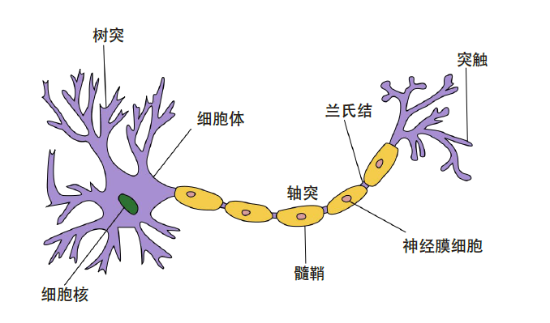

## 神经元模型

神经元是神经网络中最基本的结构，也是构成神经网络的基本单元，其主要是模拟生物神经元的结构和特性，接收一组输入信号并产出
输出。它的设计灵感完全来源于生物学上神经元的信息传播机制。学过生物的同学都知道，神经元有两种状态：兴奋和抑制。一般情况下，大多数的神经元是处于抑制状态，但是一旦某个神经元收到刺激，导致它的电位超过一个**阈值**，那么这个神经元就会被激活，处于“兴奋”状态，进而向其他的神经元传播化学物质（其实就是信息）。

　　下图为生物学上的神经元结构示意图：

## 人工神经网络

**人工神经网络（**Artificial Neural Network，ANN）是指一系列受生物学和神经学启发的、为模拟人脑神经网络而设计的数学模型，它从结构、实现机理和功能上模拟人脑神经网络。这些模型主要是通过对人脑的神经元网络进行抽象，构建人工神经元，并按照一定拓扑结构来建立人工神经元之间的连接，来模拟生物神经网络。在人工智能领域，人工神经网络也常常简称为神经网络（Neural Network，NN）或神经模型（Neural Model）。

与生物神经元类似，人工神经网络由多个节点（人工神经元）互相连接而成，可以用来对数据之间的复杂关系进行建模。不同节点之间的连接被赋予了不同的权重，每个权重代表了一个节点对另一个节点的影响大小。每个节点代表一种特定函数，来自其他节点的信息经过其相应的权重综合计算，输入到一个激活函数中并得到一个新的活性值（兴奋或抑制）。从系统观点看，人工神经元网络是由大量神经元通过极其丰富和完善的连接而构成的自适应非线性动态系统。

1943年，McCulloch和Pitts根据上图的生物神经元结构用一种简单的模型进行了表示，提出了一种非常简单的神经元模型，也就是我们现在经常用到的“**M-P神经元**模型”，如下图所示：

　　从上图M-P神经元模型可以看出，神经元的输出
$$
y = f(\sum_{i=1}^{n}w_{i}x_{i} - \theta)
$$
　　其中$\theta$为我们之前提到的神经元的激活阈值，函数$f(⋅)$也被称为是**激活函数**，一共有$m$个输入$x_1,x_2,...,x_m$，$w_1,w_2,...w_m$位各输入的权重。如上图所示，函数$f(⋅)$可以用一个阶跃方程表示，大于阈值激活；否则则抑制。但是这样有点太粗暴，因为阶跃函数不光滑，不连续，不可导，因此我们更常用的方法是用sigmoid函数来表示函数函数$f(⋅)$。

　　sigmoid函数的表达式和分布图如下所示：

$$
f(x) = \frac{1}{1+e^{-x}}
$$

**激活函数**在神经元中非常重要的。为了增强网络的表示能力和学习能力，激活函数需要具备以下几点性质：

1. 连续并可导（允许少数点上不可导）的非线性函数。可导的激活函数可以直接利用数值优化的方法来学习网络参数。
  
2. 激活函数及其导函数要尽可能的简单，有利于提高网络计算效率。

3. 激活函数的导函数的值域要在一个合适的区间内，不能太大也不能太小，否则会影响训练的效率和稳定性。

  

下面介绍几种在神经网络中常用的激活函数。

1. Sigmoid型函数	

   Sigmoid 型函数是指一类S型曲线函数，为两端饱和函数。常用的Sigmoid 型函数有Logistic 函数和Tanh 函数。

   

2. ReLU函数

   ReLU（Rectified Linear Unit，修正线性单元）[Nair et al., 2010]，也叫Rectifier 函数[Glorot et al., 2011]，是目前深层神经网络中经常使用的激活函数。ReLU实际上是一个斜坡（ramp）函数，定义为
   $$
   ReLU(x)=
   \begin{cases}
       x & x \geq 0 \\
       0 & x \leq 0
   \end{cases}
   $$

   $$
   max(0,x)
   $$

   

3. 

  

## 感知机与神经网络

感知机（perceptron）是由两层神经元组成的结构，输入层用于接受外界输入信号，输出层（也被称为是感知机的功能层）就是M-P神经元。下图表示了一个输入层具有三个神经元（分别表示为$x_{0}$、$x_{1}$、$x_{2}$）的感知机结构：

　　根据上图不难理解，感知机模型可以由如下公式表示：
$$
y = f(wx + b)
$$
其中，$w$为感知机输入层到输出层连接的权重，$b$表示输出层的偏置

## 多层感知机

## 为什么要用神经网络？

- 特征提取的高效性。

 　大家可能会疑惑，对于同一个分类任务，我们可以用机器学习的算法来做，为什么要用神经网络呢？大家回顾一下，一个分类任务，我们在用机器学习算法来做时，首先要明确特征feature和标签label，然后把这个数据"灌"到算法里去训练，最后保存模型，再来预测分类的准确性。但是这就有个问题，即我们需要实现确定好特征，每一个特征即为一个维度，特征数目过少，我们可能无法精确的分类出来，即我们所说的欠拟合，如果特征数目过多，可能会导致我们在分类过程中过于注重某个特征导致分类错误，即过拟合。

　　举个简单的例子，现在有一堆数据集，让我们分类出西瓜和冬瓜，如果只有两个特征：形状和颜色，可能没法分区来；如果特征的维度有：形状、颜色、瓜瓤颜色、瓜皮的花纹等等，可能很容易分类出来；如果我们的特征是：形状、颜色、瓜瓤颜色、瓜皮花纹、瓜蒂、瓜籽的数量，瓜籽的颜色、瓜籽的大小、瓜籽的分布情况、瓜籽的XXX等等，很有可能会过拟合，譬如有的冬瓜的瓜籽数量和西瓜的类似，模型训练后这类特征的权重较高，就很容易分错。这就导致我们在特征工程上需要花很多时间和精力，才能使模型训练得到一个好的效果。然而神经网络的出现使我们**不需要做大量的特征工程**，譬如提前设计好特征的内容或者说特征的数量等等，我们可以直接把数据灌进去，让它自己训练，自我“修正”，即可得到一个较好的效果。

- 数据格式的简易性

　　在一个传统的机器学习分类问题中，我们“灌”进去的数据是不能直接灌进去的，需要对数据进行一些处理，譬如量纲的归一化，格式的转化等等，不过在神经网络里我们不需要额外的对数据做过多的处理，具体原因可以看后面的详细推导。

- 参数数目的少量性

　　在面对一个分类问题时，如果用SVM来做，我们需要调整各种参数如核函数，惩罚因子，松弛变量等等，不同的参数组合对于模型的效果也不一样，想要迅速而又准确的调到最适合模型的参数需要对背后理论知识的深入了解(当然，如果你说全部都试一遍也是可以的，但是花的时间可能会更多)，而对于一个基本的三层神经网络来说(输入-隐含-输出)，我们只需要初始化时给每一个神经元上随机的赋予一个权重$w$和偏置项$b$，在训练过程中，这两个参数会不断的修正，调整到最优质，使模型的误差最小。所以从这个角度来看，我们对于调参的背后理论知识并不需要过于精通(只不过做多了之后可能会有一些经验，在初始值时赋予的值更科学，收敛的更快罢了)