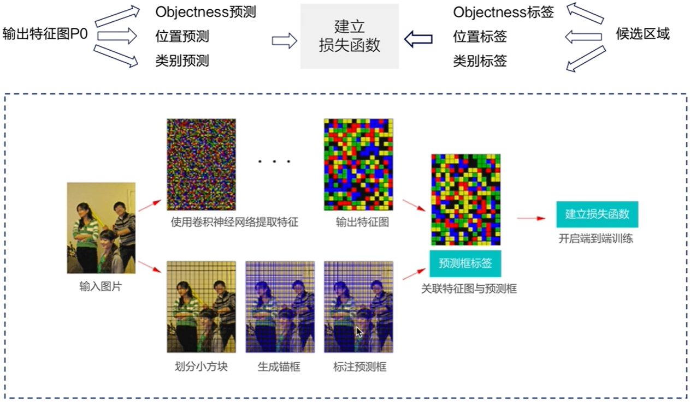
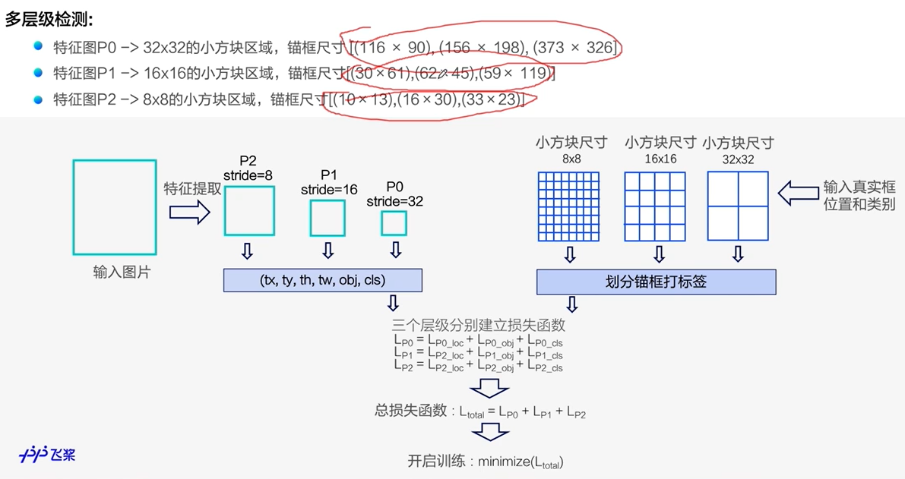
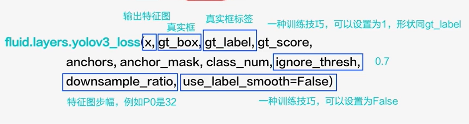
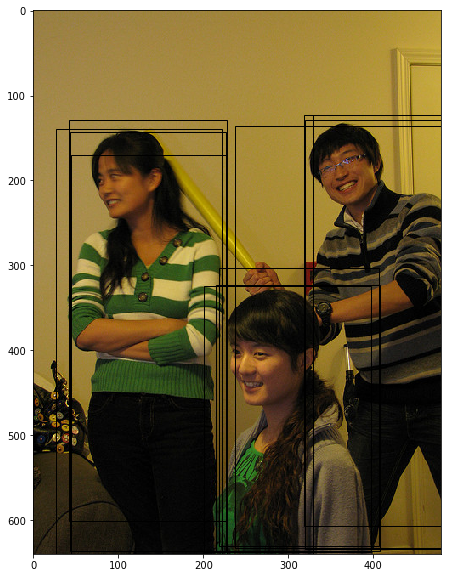
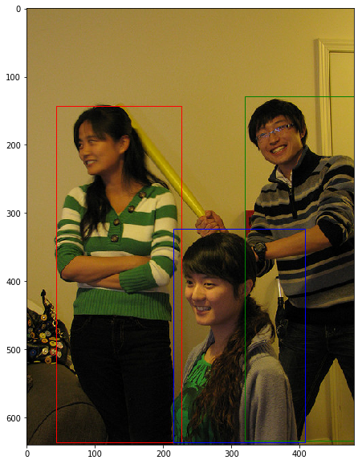

# YOLO-V3

R-CNN系列的Two-stage算法需要先产生候选区域，再对候选区域做分类和位置坐标的预。近几年，很多研究人员相继提出一系列单阶段的检测算法，只需要一个网络即可同时产生候选区域并预测出物体的类别和位置坐标。

与R-CNN系列算法不同，YOLO-V3使用单个网络结构，**在产生候选区域的同时即可预测出物体类别和位置**，不需要分成两阶段来完成检测任务。另外，YOLO-V3算法产生的预测框数目比Faster R-CNN少很多。Faster R-CNN中每个真实框可能对应多个标签为正的候选区域，而YOLO-V3里面每个真实框只对应一个正的候选区域。这些特性使得YOLO-V3算法具有更快的速度，能到达实时响应的水平。

Joseph Redmon等人在2015年提出YOLO（You Only Look Once，YOLO）算法，通常也被称为YOLO-V1；2016年，他们对算法进行改进，又提出YOLO-V2版本；2018年发展出YOLO-V3版本。

## YOLO-V3 模型设计思想

YOLO-V3算法的基本思想可以分成两部分：

* 按一定规则在图片上**产生**一系列的**候选区域**，然后根据这些**候选区域与图片上物体真实框之间的位置关系对候选区域进行标注**。跟真实框足够接近的那些候选区域会被标注为正样本，同时将真实框的位置作为正样本的位置目标。偏离真实框较大的那些候选区域则会被标注为负样本，负样本不需要预测位置或者类别。
* 使用卷积**神经网络提取图片特征并对候选区域的位置和类别进行预测**。这样每个预测框就可以看成是一个样本，根据真实框相对它的位置和类别进行了标注而获得标签值，通过网络模型预测其位置和类别，将网络预测值和标签值进行比较，就可以建立起损失函数。

YOLO-V3算法训练过程的流程图如 **图8** 所示：

<center></center>
<center><br>图8：YOLO-V3算法训练流程图 </br></center>


* **图8** 左边是输入图片，上半部分所示的过程是使用卷积神经网络对图片提取特征，随着网络不断向前传播，特征图的尺寸越来越小，每个像素点会代表更加抽象的特征模式，直到输出特征图，其尺寸减小为原图的$\frac{1}{32}$。
* **图8** 下半部分描述了生成候选区域的过程，首先将原图划分成多个小方块，每个小方块的大小是$32 \times 32$，然后以每个小方块为中心分别生成一系列锚框，整张图片都会被锚框覆盖到。在每个锚框的基础上产生一个与之对应的预测框，根据锚框和预测框与图片上物体真实框之间的位置关系，对这些预测框进行标注。
* 将上方支路中输出的**特征图**与下方支路中产生的**预测框标签建立关联**，创建损失函数，开启端到端的训练过程。

接下来具体介绍流程中各节点的原理和代码实现。

## yolo-v3原理解析

### 产生候选区域

如何产生候选区域，是检测模型的核心设计方案。目前大多数基于卷积神经网络的模型所采用的方式大体如下：

* 按一定的规则在图片上**生成**一系列位置固定的**锚框**，将这些锚框看作是可能的候选区域。
* 对锚框是否包含目标物体进行预测，如果包含目标物体，还需要预测所包含物体的**类别**，以及预测框相对于锚框位置需**要调整的幅度**。

#### 生成锚框

Step1：将原始图片划分成$m\times n$个区域，如下图所示，原始图片高度$H=640$, 宽度$W=480$，如果我们选择小块区域的尺寸为$32 \times 32$，则$m$和$n$分别为：

$$
m = \frac{640}{32} = 20
$$

$$
n = \frac{480}{32} = 15
$$

如 图9 所示，将原始图像分成了20行15列小方块区域。


<center></center>
<center><br>图9：将图片划分成多个32x32的小方块 </br></center>

Step2：YOLO-V3算法会**在每个区域的中心，生成一系列锚框**。为了展示方便，我们先在图中第十行第四列的小方块位置附近画出生成的锚框，如 **图10** 所示。

------

**注意：**

这里为了跟程序中的编号对应，最上面的行号是第0行，最左边的列号是第0列

------


<center></center>
<center><br>图10：在第10行第4列的小方块区域生成3个锚框 </br></center>

**图11** 展示在**每个区域附近都生成3个锚框**，很多锚框堆叠在一起可能不太容易看清楚，但过程跟上面类似，只是需要以每个区域的中心点为中心，分别生成3个锚框。


<center></center>
<center><br>图11：在每个小方块区域生成3个锚框 </br></center>


#### 生成预测框

在前面已经指出，锚框的位置都是固定好的，不可能刚好跟物体边界框重合，需要**在锚框的基础上进行位置的微调以生成预测框**。预测框相对于锚框会有不同的中心位置和大小，采用什么方式能得到预测框呢？我们先来考虑如何生成其中心位置坐标。

比如上面图中在第10行第4列的小方块区域中心生成的一个锚框，如绿色虚线框所示。以小方格的宽度为单位长度，

此小方块区域左上角的位置坐标是：
$$
c_x = 4
$$

$$
c_y = 10
$$

此锚框的区域中心坐标是：
$$
center\_x = c_x + 0.5 = 4.5
$$

$$
center\_y = c_y + 0.5 = 10.5
$$

可以通过下面的方式生成预测框的中心坐标：
$$
b_x = c_x + \sigma(t_x)
$$

$$
b_y = c_y + \sigma(t_y)
$$

其中$t_x$和$t_y$为实数，$\sigma(x)$是我们之前学过的Sigmoid函数，其定义如下：

$$
\sigma(x) = \frac{1}{1 + exp(-x)}
$$

由于Sigmoid的函数值在$0 \thicksim 1$之间，因此由上面公式计算出来的**预测框的中心点总是落在第十行第四列的小区域内部**。

当$t_x=t_y=0$时，$b_x = c_x + 0.5$，$b_y = c_y + 0.5$，预测框中心与锚框中心重合，都是小区域的中心。

**锚框的大小是预先设定好的，在模型中可以当作是超参数**，下图中画出的锚框尺寸是
$$
p_h = 350
$$

$$
p_w = 250
$$

通过下面的公式生成预测框的大小：

$$
b_h = p_h e^{t_h}
$$

$$
b_w = p_w e^{t_w}
$$

如果$t_x=t_y=0, t_h=t_w=0$，则预测框跟锚框重合。

如果给$t_x, t_y, t_h, t_w$随机赋值如下：

$$
t_x = 0.2,  t_y = 0.3, t_w = 0.1, t_h = -0.12
$$

则可以得到预测框的坐标是(154.98, 357.44, 276.29, 310.42)，如 **图12** 中蓝色框所示。

------

**说明：**
这里坐标采用$xywh$的格式。

-------


<center></center>
<center><br>图12：生成预测框 </br></center>


这里我们会问：当$t_x, t_y, t_w, t_h$取值为多少的时候，预测框能够跟真实框重合？为了回答问题，只需要将上面预测框坐标中的$b_x, b_y, b_h, b_w$设置为真实框的位置，即可求解出$t$的数值。

令：
$$
\sigma(t^*_x) + c_x = gt_x
$$

$$
\sigma(t^*_y) + c_y = gt_y
$$

$$
p_w e^{t^*_w} = gt_h
$$

$$
p_h e^{t^*_h} = gt_w
$$

可以求解出 $(t^*_x, t^*_y, t^*_w, t^*_h)$

**如果$t$是网络预测的输出值，将$t^*$作为目标值，以他们之间的差距作为损失函数，则可以建立起一个回归问题，通过学习网络参数，使得$t$足够接近$t^*$，从而能够求解出预测框的位置坐标和大小。**

预测框可以看作是在锚框基础上的一个微调，每个锚框会有一个跟它对应的预测框，我们需要确定上面计算式中的$t_x, t_y, t_w, t_h$，从而计算出与锚框对应的预测框的位置和形状。

#### 对候选区域进行标注

每个区域可以产生3种不同形状的锚框，每个锚框都是一个可能的候选区域，对这些候选区域我们需要了解如下几件事情：

- 锚框是否包含物体，这可以看成是一个二分类问题，使用标签**objectness**来表示。当锚框包含了物体时，objectness=1，表示预测框属于正类；当锚框不包含物体时，设置objectness=0，表示锚框属于负类。

- 如果锚框包含了物体，那么它对应的预测框的中心位置和大小应该是多少，或者说上面计算式中的$t_x, t_y, t_w, t_h$应该是多少，使用**location**标签。

- 如果锚框包含了物体，那么具体类别是什么，这里使用变量**classification**来表示其所属类别的标签。

选取任意一个锚框对它进行标注，也就是需要确定其对应的objectness, $(t_x, t_y, t_w, t_h)$和label，下面将分别讲述如何确定这三个标签的值。

##### 标注锚框是否包含物体-objectness

如 **图13** 所示，这里一共有3个目标，以最左边的人像为例，其真实框是$(40.93, 141.1, 186.06, 374.63)$。

<center></center>
<center><br>图13：选出与真实框中心位于同一区域的锚框 </br></center>


真实框的中心点坐标是：$center\_x = 40.93 + 186.06 / 2 = 133.96$ ，$center\_y = 141.1 + 374.63 / 2 = 328.42$

$ i = 133.96 / 32 = 4.18625$，$ j = 328.42 / 32 = 10.263125$

它落在了第10行第4列的小方块内，如**图13**所示。此小方块区域可以生成3个不同形状的锚框，其在图上的编号和大小分别是$A_1(116, 90), A_2(156, 198), A_3(373, 326)$。

**用这3个不同形状的锚框跟真实框计算IoU，选出IoU最大的锚框**。这里为了简化计算，只考虑锚框的形状，不考虑其跟真实框中心之间的偏移，具体计算结果如 **图14** 所示。


<center></center>
<center><br>图14：选出与真实框与锚框的IoU </br></center>


其中跟真实框IoU最大的是锚框$A_3$，形状是$(373, 326)$，将它所对应的预测框的objectness标签设置为1，其所包括的物体类别就是真实框里面的物体所属类别。

依次可以找出其他几个真实框对应的IoU最大的锚框，然后将它们的预测框的objectness标签也都设置为1。这里一共有$20 \times 15 \times 3 = 900$个锚框，只有3个预测框会被标注为正。

由于**每个真实框只对应一个objectness标签为正的预测框**，如果有些预测框跟真实框之间的IoU很大，但并不是最大的那个，那么直接将其objectness标签设置为0当作负样本，可能并不妥当。为了避免这种情况，YOLO-V3算法**设置了一个IoU阈值iou_threshold（超参数，YOLO-V3里设置为0.7），当预测框的objectness不为1，但是其与某个真实框的IoU大于iou_threshold时，就将其objectness标签设置为-1，不参与损失函数的计算。**

所有其他的预测框，其objectness标签均设置为0，表示负类。

对于objectness=1的预测框，需要进一步确定其位置和包含物体的具体分类标签，但是对于objectness=0或者-1的预测框，则不用管他们的位置和类别。

##### 标注预测框的位置坐标标签-location

当锚框objectness=1时，需要确定预测框位置相对于它微调的幅度，也就是锚框的位置标签。

在前面我们已经问过这样一个问题：当$t_x, t_y, t_w, t_h$取值为多少的时候，预测框能够跟真实框重合？其做法是将预测框坐标中的$b_x, b_y, b_h, b_w$设置为真实框的坐标$gt_z, gt_y, gt_w, gt_h$，即可求解出$t$的数值。令：

$$
\sigma(t^*_x) + c_x = gt_x
$$
$$
\sigma(t^*_y) + c_y = gt_y
$$
$$
p_w e^{t^*_w} = gt_w
$$
$$
p_h e^{t^*_h} = gt_h
$$

对于$t_x^*$和$t_y^*$，由于Sigmoid的反函数不好计算，我们直接使用$\sigma(t^*_x)$和$\sigma(t^*_y)$作为回归的目标。

$$
d_x^* = \sigma(t^*_x) = gt_x - c_x
$$

$$
d_y^* = \sigma(t^*_y) = gt_y - c_y
$$

$$
t^*_w = log(\frac{gt_w}{p_w})
$$

$$
t^*_h = log(\frac{gt_h}{p_h})
$$

如果$(t_x, t_y, t_h, t_w)$是网络预测的输出值，将$(d_x^*, d_y^*, t_w^*, t_h^*)$作为$(\sigma(t_x), \sigma(t_y), t_h, t_w)$的目标值，以它们之间的差距作为损失函数，则可以建立起一个回归问题，通过学习网络参数，使得$t$足够接近$t^*$，从而能够求解出预测框的位置。

##### 标注锚框包含物体类别的标签-classification

对于objectness=1的锚框，需要确定其具体类别。正如上面所说，objectness标注为1的锚框，会有一个真实框跟它对应，该锚框所属物体类别，即是其所对应的真实框包含的物体类别。这里YOLO-V3模型对每个类别独立的计算概率，标注的时候使用one-hot向量来表示类别标签label。比如一共有10个分类，而真实框里面包含的物体类别是第2类，则label为$(0,1,0,0,0,0,0,0,0,0)$

对上述步骤进行总结，标注的流程如 **图15** 所示。

<center></center>
<center><br>图15：标注流程示意图 </br></center>

通过这种方式，我们在每个小方块区域都生成了一系列的锚框作为候选区域，并且根据图片上真实物体的位置，计算出每个锚框需要的标注数据个数：$location(4)+objectness(1)+classification(C):5+C$，其中

+ 标注出了每个候选区域对应的objectness标签：用1个变量$obj$描述；

+ 位置location需要调整的幅度：由4个变量描述$(t_x, t_y, t_w, t_h)$

+ 包含的物体所属的类别classification：需要描述所属类别的变量长度等于类别数C

对于$m\times n$个方块区域，每个区域$K$个锚框，这标注数据的维度是$[K(5+C)]\times m \times n$

对于每个锚框，模型需要预测输出$(t_x, t_y, t_w, t_h, P_{obj}, P_1, P_2,... , P_C)$，其中$P_{obj}$是锚框是否包含物体的概率，$P_1, P_2,... , P_C$则是锚框包含的物体属于每个类别的概率。接下来让我们一起学习如何通过卷积神经网络输出这样的预测值。

#### 标注锚框的具体程序

上面描述了如何对预锚框进行标注，但读者可能仍然对里面的细节不太了解，下面将通过具体的程序完成这一步骤。

```python
# 标注预测框的objectness
def get_objectness_label(img, gt_boxes, gt_labels, iou_threshold = 0.7,
                         anchors = [116, 90, 156, 198, 373, 326],
                         num_classes=7, downsample=32):
    """
    img 是输入的图像数据，形状是[N, C, H, W]
    gt_boxes，真实框，维度是[N, 50, 4]，其中50是真实框数目的上限，当图片中真实框不足50个时，不足部分的坐标全为0
              真实框坐标格式是xywh，这里使用相对值
    gt_labels，真实框所属类别，维度是[N, 50]
    iou_threshold，当预测框与真实框的iou大于iou_threshold时不将其看作是负样本
    anchors，锚框可选的尺寸
    anchor_masks，通过与anchors一起确定本层级的特征图应该选用多大尺寸的锚框
    num_classes，类别数目
    downsample，特征图相对于输入网络的图片尺寸变化的比例，即小方块区域的大小
    """

    img_shape = img.shape
    batchsize = img_shape[0]
    num_anchors = len(anchors) // 2
    input_h = img_shape[2]
    input_w = img_shape[3]
    # 将输入图片划分成num_rows x num_cols个小方块区域，每个小方块的边长是 downsample
    # 计算小方块区域的行数和列数
    num_rows = input_h // downsample
    num_cols = input_w // downsample

    # 全部初始化为0
    label_objectness = np.zeros([batchsize, num_anchors, num_rows, num_cols])# [N,K,m,n]
    label_classification = np.zeros([batchsize, num_anchors, num_classes, num_rows, num_cols])# [N,K,C,m,n]
    label_location = np.zeros([batchsize, num_anchors, 4, num_rows, num_cols])# [N,K,4,m,n]

    # 位置损失函数的加权因子，调整不同大小物体和权重，初始化为1
    scale_location = np.ones([batchsize, num_anchors, num_rows, num_cols])

    # 对batchsize进行循环，依次处理每张图片
    for n in range(batchsize):
        # 对图片上的真实框进行循环，依次找出跟真实框形状最匹配的锚框
        for n_gt in range(len(gt_boxes[n])):
            gt = gt_boxes[n][n_gt]
            gt_cls = gt_labels[n][n_gt]
            gt_center_x = gt[0]
            gt_center_y = gt[1]
            gt_width = gt[2]
            gt_height = gt[3]
            # 真实框最大个数设置为50，有部分是无效的，直接跳过无效的真实框
            if (gt_height < 1e-3) or (gt_height < 1e-3):
                continue
            # 找出真实框中心区域
            i = int(gt_center_y * num_rows)
            j = int(gt_center_x * num_cols)
            
            ious = []
            # 对第i行第j列小方块区域内的所有锚框做循环
            for ka in range(num_anchors):
                bbox1 = [0., 0., float(gt_width), float(gt_height)]
                anchor_w = anchors[ka * 2]
                anchor_h = anchors[ka * 2 + 1]
                bbox2 = [0., 0., anchor_w/float(input_w), anchor_h/float(input_h)]
                # 计算iou 只考虑锚框和真实的位置不考虑中心位置，目的是找出与真实框形状最匹配的锚框
                iou = box_iou_xywh(bbox1, bbox2)
                ious.append(iou)
            
            # 选出与真实框IoU最大的锚框
            ious = np.array(ious)
            inds = np.argsort(ious)
            k = inds[-1]
            
            # 将IoU最大的锚框objectness设1，类别设置为对应的真实框类别
            label_objectness[n, k, i, j] = 1
            c = gt_cls
            label_classification[n, k, c, i, j] = 1.

            # for those prediction bbox with objectness =1, set label of location计算位置标签
            dx_label = gt_center_x * num_cols - j
            dy_label = gt_center_y * num_rows - i
            dw_label = np.log(gt_width * input_w / anchors[k*2])
            dh_label = np.log(gt_height * input_h / anchors[k*2 + 1])
            # 设置objectness为1的锚框的位置标签
            label_location[n, k, 0, i, j] = dx_label
            label_location[n, k, 1, i, j] = dy_label
            label_location[n, k, 2, i, j] = dw_label
            label_location[n, k, 3, i, j] = dh_label
            # scale_location用来调节不同尺寸的锚框对损失函数的贡献，作为加权系数和位置损失函数相乘，较小的问题有更大的权重
            scale_location[n, k, i, j] = 2.0 - gt_width * gt_height

    # 目前根据每张图片上所有出现过的gt box，都标注出了objectness为正的预测框，剩下的预测框则默认objectness为0
    # 对于objectness为1的预测框，标出了他们所包含的物体类别，以及位置回归的目标
    return label_objectness.astype('float32'), label_location.astype('float32'), label_classification.astype('float32'), \
             scale_location.astype('float32')
```


```python
# 读取数据
reader = multithread_loader('/home/aistudio/work/insects/train', batch_size=2, mode='train')
img, gt_boxes, gt_labels, im_shape = next(reader())
# 计算出锚框对应的标签
label_objectness, label_location, label_classification, scale_location = get_objectness_label(img,
                                                                                              gt_boxes, gt_labels, 
                                                                                              iou_threshold = 0.7,
                                                                                              anchors = [116, 90, 156, 198, 373, 326],
                                                                                              num_classes=7, downsample=32)

```


```python
img.shape, gt_boxes.shape, gt_labels.shape, im_shape.shape
```


    ((2, 3, 320, 320), (2, 50, 4), (2, 50), (2, 2))


```python
label_objectness.shape, label_location.shape, label_classification.shape, scale_location.shape
```


    ((2, 3, 10, 10), (2, 3, 4, 10, 10), (2, 3, 7, 10, 10), (2, 3, 10, 10))


上面的程序实现了对锚框进行标注，对于每个真实框，选出了与它形状最匹配的锚框，将其objectness标注为1，并且将$[d_x^*, d_y^*, t_h^*, t_w^*]$作为正样本位置的标签，真实框包含的物体类别作为锚框的类别。而其余的锚框，objectness将被标注为0，无需标注出位置和类别的标签。

- 注意：这里还遗留一个小问题，前面我们说了对于与真实框IoU较大的那些锚框，需要将其objectness标注为-1，不参与损失函数的计算。我们先将这个问题放一放，等到后面建立损失函数的时候再补上。

------

### 提取特征——卷积神经网络

在前面的内容中我们已经学习过了通过卷积神经网络提取图像特征。通过连续使用多层卷积和池化等操作，能得到语义含义更加丰富的特征图。在检测问题中，也使用卷积神经网络逐层提取图像特征，**通过最终的输出特征图来表征物体位置和类别等信息**。

YOLO-V3算法使用的骨干网络是Darknet53，是用来训练分类模型的网络结构，在ImageNet图像分类任务上取得了很好的成绩。Darknet53网络的具体结构如图16所示，一共52层卷积+1层全连接。但在检测任务中，我们要将图中C0后面的平均池化、全连接层和Softmax去掉，保留从输入到C0部分的网络结构，作为检测模型的基础网络结构，也称为**骨干网络(backbone)**。YOLO-V3模型会在骨干网络的基础上，再添加检测相关的网络模块。


<center></center>
<center><br>图16：Darknet53网络结构 </br></center>

在YOLO-V3算法中使用了C0、C1、C2三个层级的特征图来产生候选区域的输出，为了简化问题，我们先只使用C0来展示具体的算法，随后再介绍如何使用多层级特征图。

下面的程序是Darknet53骨干网络的实现代码，这里将上图中C0、C1、C2所表示的输出数据取出，并查看它们的形状分别是，$C0 [1, 1024, 20, 20]$，$C1 [1, 512, 40, 40]$，$C2 [1, 256, 80, 80]$。

- 名词解释：特征图的步幅(stride)

  在提取特征的过程中通常会使用步幅大于1的卷积或者池化，导致后面的特征图尺寸越来越小，特征图的步幅等于输入图片尺寸除以特征图尺寸。例如C0的尺寸是$20\times20$，原图尺寸是$640\times640$，则C0的步幅是$\frac{640}{20}=32$。同理，C1的步幅是16，C2的步幅是8。在C0上移动一个像素点相当于在原图移动32个像素点。


```python
import paddle.fluid as fluid
from paddle.fluid.param_attr import ParamAttr
from paddle.fluid.regularizer import L2Decay

from paddle.fluid.dygraph.nn import Conv2D, BatchNorm
from paddle.fluid.dygraph.base import to_variable

# YOLO-V3骨干网络结构Darknet53的实现代码

class ConvBNLayer(fluid.dygraph.Layer):
    """
    卷积 + 批归一化，BN层之后激活函数默认用leaky_relu
    """
    def __init__(self,
                 ch_in,
                 ch_out,
                 filter_size=3,
                 stride=1,
                 groups=1,
                 padding=0,
                 act="leaky",
                 is_test=True):
        super(ConvBNLayer, self).__init__()

        self.conv = Conv2D(
            num_channels=ch_in,
            num_filters=ch_out,
            filter_size=filter_size,
            stride=stride,
            padding=padding,
            groups=groups,
            param_attr=ParamAttr(
                initializer=fluid.initializer.Normal(0., 0.02)),
            bias_attr=False,
            act=None)

        self.batch_norm = BatchNorm(
            num_channels=ch_out,
            is_test=is_test,
            param_attr=ParamAttr(
                initializer=fluid.initializer.Normal(0., 0.02),
                regularizer=L2Decay(0.)),
            bias_attr=ParamAttr(
                initializer=fluid.initializer.Constant(0.0),
                regularizer=L2Decay(0.)))
        self.act = act

    def forward(self, inputs):
        out = self.conv(inputs)
        out = self.batch_norm(out)
        if self.act == 'leaky':
            out = fluid.layers.leaky_relu(x=out, alpha=0.1)
        return out

class DownSample(fluid.dygraph.Layer):
    """
    下采样，图片尺寸减半，具体实现方式是使用stirde=2的卷积
    """
    def __init__(self,
                 ch_in,
                 ch_out,
                 filter_size=3,
                 stride=2,
                 padding=1,
                 is_test=True):

        super(DownSample, self).__init__()

        # 卷积批归一化块
        self.conv_bn_layer = ConvBNLayer(
            ch_in=ch_in,
            ch_out=ch_out,
            filter_size=filter_size,
            stride=stride,
            padding=padding,
            is_test=is_test)
        self.ch_out = ch_out
    def forward(self, inputs):
        out = self.conv_bn_layer(inputs)
        return out

class BasicBlock(fluid.dygraph.Layer):
    """
    基本残差块的定义，输入x经过两层卷积，然后接第二层卷积的输出和输入x相加
    """
    def __init__(self, ch_in, ch_out, is_test=True):
        super(BasicBlock, self).__init__()

        self.conv1 = ConvBNLayer(
            ch_in=ch_in,
            ch_out=ch_out,
            filter_size=1,
            stride=1,
            padding=0,
            is_test=is_test
            )
        self.conv2 = ConvBNLayer(
            ch_in=ch_out,
            ch_out=ch_out*2,
            filter_size=3,
            stride=1,
            padding=1,
            is_test=is_test
            )
    def forward(self, inputs):
        conv1 = self.conv1(inputs)
        conv2 = self.conv2(conv1)
        out = fluid.layers.elementwise_add(x=inputs, y=conv2, act=None)
        return out

class LayerWarp(fluid.dygraph.Layer):
    """
    添加多层残差块，组成Darknet53网络的一个层级
    """
    def __init__(self, ch_in, ch_out, count, is_test=True):
        super(LayerWarp,self).__init__()

        self.basicblock0 = BasicBlock(ch_in,
            ch_out,
            is_test=is_test)
        self.res_out_list = []
        for i in range(1, count):
            res_out = self.add_sublayer("basic_block_%d" % (i), #使用add_sublayer添加子层
                BasicBlock(ch_out*2,
                    ch_out,
                    is_test=is_test))
            self.res_out_list.append(res_out)

    def forward(self,inputs):
        y = self.basicblock0(inputs)
        for basic_block_i in self.res_out_list:
            y = basic_block_i(y)
        return y

DarkNet_cfg = {53: ([1, 2, 8, 8, 4])}

class DarkNet53_conv_body(fluid.dygraph.Layer):
    def __init__(self,
                 
                 is_test=True):
        super(DarkNet53_conv_body, self).__init__()
        self.stages = DarkNet_cfg[53]
        self.stages = self.stages[0:5]

        # 第一层卷积
        self.conv0 = ConvBNLayer(
            ch_in=3,
            ch_out=32,
            filter_size=3,
            stride=1,
            padding=1,
            is_test=is_test)

        # 下采样，使用stride=2的卷积来实现
        self.downsample0 = DownSample(
            ch_in=32,
            ch_out=32 * 2,
            is_test=is_test)

        # 添加各个层级的实现
        self.darknet53_conv_block_list = []
        self.downsample_list = []
        for i, stage in enumerate(self.stages):
            conv_block = self.add_sublayer(
                "stage_%d" % (i),
                LayerWarp(32*(2**(i+1)),
                32*(2**i),
                stage,
                is_test=is_test))
            self.darknet53_conv_block_list.append(conv_block)
        # 两个层级之间使用DownSample将尺寸减半
        for i in range(len(self.stages) - 1):
            downsample = self.add_sublayer(
                "stage_%d_downsample" % i,
                # 步幅为2的卷积+BN
                DownSample(ch_in=32*(2**(i+1)),
                    ch_out=32*(2**(i+2)),
                    is_test=is_test))
            self.downsample_list.append(downsample)

    def forward(self,inputs):
        out = self.conv0(inputs)
        #print("conv1:",out.numpy())
        out = self.downsample0(out)
        #print("dy:",out.numpy())
        blocks = []
        for i, conv_block_i in enumerate(self.darknet53_conv_block_list): #依次将各个层级作用在输入上面
            out = conv_block_i(out)
            blocks.append(out)
            if i < len(self.stages) - 1:
                out = self.downsample_list[i](out)
        return blocks[-1:-4:-1] # 将C0, C1, C2作为返回值
```
创建Darknet53骨干网络模块

```python
# 查看Darknet53网络输出特征图
import numpy as np
with fluid.dygraph.guard():
    backbone = DarkNet53_conv_body(is_test=False)
    x = np.random.randn(1, 3, 640, 640).astype('float32')
    x = to_variable(x)
    C0, C1, C2 = backbone(x)
    print(C0.shape, C1.shape, C2.shape)
```

    [1, 1024, 20, 20] [1, 512, 40, 40] [1, 256, 80, 80]

上面这段示例代码，指定输入数据的形状是$(1, 3, 640, 640)$，则3个层级的输出特征图的形状分别是$C0 (1, 1024, 20, 20)$，$C1 (1, 1024, 40, 40)$和$C2 (1, 1024, 80, 80)$。

------

### 根据输出特征图计算预测框位置和类别

YOLO-V3中对每个预测框计算逻辑如下：

- 预测框是否包含物体。也可理解为objectness=1的概率是多少，可以用网络输出一个实数$x$，可以用$Sigmoid(x)$表示objectness为正的概率$P_{obj}$

- 预测物体位置和形状。物体位置和形状$t_x, t_y, t_w, t_h$可以用网络输出4个实数来表示$t_x, t_y, t_w, t_h$

- 预测物体类别。预测图像中物体的具体类别是什么，或者说其属于每个类别的概率分别是多少。总的类别数为C，需要预测物体属于每个类别的概率$(P_1, P_2, ..., P_C)$，可以用网络输出C个实数$(x_1, x_2, ..., x_C)$，对每个实数分别求Sigmoid函数，让$P_i = Sigmoid(x_i)$，则可以表示出物体属于每个类别的概率。


对于一个预测框，网络需要输出$(5 + C)$个实数来表征它是否包含物体、位置和形状尺寸以及属于每个类别的概率。

由于我们在每个小方块区域都生成了K个预测框，则所有预测框一共需要网络输出的预测值数目是：

$$[K(5 + C)] \times m \times n $$

还有更重要的一点是网络输出必须要能区分出小方块区域的位置来，不能直接将特征图连接一个输出大小为$[K(5 + C)] \times m \times n$的全连接层。

------

#### 建立输出特征图与预测框之间的关联

现在观察特征图，经过多次卷积核池化之后，其步幅stride=32，$640 \times 480$大小的输入图片变成了$20\times15$的特征图；而小方块区域的数目正好是$20\times15$，也就是说可以让特征图上每个像素点分别跟原图上一个小方块区域对应。这也是为什么我们最开始将小方块区域的尺寸设置为32的原因，这样可以巧妙的将小方块区域跟特征图上的像素点对应起来，解决了空间位置的对应关系。

<center></center>
<center><br>图17：特征图C0与小方块区域形状对比 </br></center>


下面需要将像素点$(i,j)$与第i行第j列的小方块区域所需要的预测值关联起来，每个小方块区域产生K个预测框，每个预测框需要$(5 + C)$个实数预测值，则每个像素点相对应的要有$K(5 + C)$个实数。为了解决这一问题，对特征图进行多次卷积，并将最终的输出通道数设置为$K(5 + C)$，即可将生成的特征图与每个预测框所需要的预测值巧妙的对应起来。

骨干网络的输出特征图是C0，下面的程序是对C0进行多次卷积以得到跟预测框相关的特征图P0。


```python
# 从骨干网络输出特征图C0得到跟预测相关的特征图P0
class YoloDetectionBlock(fluid.dygraph.Layer):
    # define YOLO-V3 detection head
    # 使用多层卷积和BN提取特征
    def __init__(self,ch_in,ch_out,is_test=True):
        super(YoloDetectionBlock, self).__init__()

        assert ch_out % 2 == 0, \
            "channel {} cannot be divided by 2".format(ch_out)

        self.conv0 = ConvBNLayer(
            ch_in=ch_in,
            ch_out=ch_out,
            filter_size=1,
            stride=1,
            padding=0,
            is_test=is_test
            )
        self.conv1 = ConvBNLayer(
            ch_in=ch_out,
            ch_out=ch_out*2,
            filter_size=3,
            stride=1,
            padding=1,
            is_test=is_test
            )
        self.conv2 = ConvBNLayer(
            ch_in=ch_out*2,
            ch_out=ch_out,
            filter_size=1,
            stride=1,
            padding=0,
            is_test=is_test
            )
        self.conv3 = ConvBNLayer(
            ch_in=ch_out,
            ch_out=ch_out*2,
            filter_size=3,
            stride=1,
            padding=1,
            is_test=is_test
            )
        self.route = ConvBNLayer(
            ch_in=ch_out*2,
            ch_out=ch_out,
            filter_size=1,
            stride=1,
            padding=0,
            is_test=is_test
            )
        self.tip = ConvBNLayer(
            ch_in=ch_out,
            ch_out=ch_out*2,
            filter_size=3,
            stride=1,
            padding=1,
            is_test=is_test
            )
    def forward(self, inputs):
        out = self.conv0(inputs)
        out = self.conv1(out)
        out = self.conv2(out)
        out = self.conv3(out)
        route = self.route(out)
        tip = self.tip(route)
        return route, tip
```


```python
NUM_ANCHORS = 3
NUM_CLASSES = 7
num_filters=NUM_ANCHORS * (NUM_CLASSES + 5)
with fluid.dygraph.guard():
    # 骨干网络
    backbone = DarkNet53_conv_body(is_test=False)
    # 对C0进一步提取特征
    detection = YoloDetectionBlock(ch_in=1024, ch_out=512, is_test=False)
    输出通道数36与每个区域锚框需要的预测值个数一致
    conv2d_pred = Conv2D(num_channels=1024, num_filters=num_filters,  filter_size=1)
    
    x = np.random.randn(1, 3, 640, 640).astype('float32')
    x = to_variable(x)
    C0, C1, C2 = backbone(x)
    route, tip = detection(C0)
    P0 = conv2d_pred(tip)
    
    print(P0.shape)
```

    [1, 36, 20, 20]


如上面的代码所示，可以由特征图C0生成特征图P0，P0的形状是$[1, 36, 20, 20]$。每个小方块区域生成的锚框或者预测框的数量是3，物体类别数目是7，每个区域需要的预测值个数是$3 \times (5 + 7) = 36$，正好等于P0的输出通道数。


<center></center>
<center><br>图18：特征图P0与候选区域的关联 </br></center>


将$P0[t, 0:12, i, j]$与输入的第t张图片上小方块区域$(i, j)$第1个预测框所需要的12个预测值对应，$P0[t, 12:24, i, j]$与输入的第t张图片上小方块区域$(i, j)$第2个预测框所需要的12个预测值对应，$P0[t, 24:36, i, j]$与输入的第t张图片上小方块区域$(i, j)$第3个预测框所需要的12个预测值对应。

在第一个预测框中：

+ 前四个通道$P0[t, 0:4, i, j]$与输入的第t张图片上小方块区域$(i, j)$第1个预测框的位置对应；

+ 第五个通道$P0[t, 4, i, j]$与输入的第t张图片上小方块区域$(i, j)$第1个预测框的objectness对应；

+ 后面的7个通道$P0[t, 5:12, i, j]$与输入的第t张图片上小方块区域$(i, j)$第1个预测框的类别对应。

如此类推，特征图中每12个通道对应1个预测框

如 **图18** 所示，通过这种方式可以巧妙的将网络输出特征图，与每个小方块区域生成的预测框对应起来了。

#### 计算预测框是否包含物体的概率（第5个通道）

根据前面的分析，$P0[t, 4, i, j]$与输入的第t张图片上小方块区域$(i, j)$第1个预测框的objectness对应，$P0[t, 4+12, i, j]$与第2个预测框的objectness对应，...，则可以使用下面的程序将objectness相关的预测取出，并使用`fluid.layers.sigmoid`计算输出概率。


```python
NUM_ANCHORS = 3
NUM_CLASSES = 7
num_filters=NUM_ANCHORS * (NUM_CLASSES + 5)
with fluid.dygraph.guard():
    backbone = DarkNet53_conv_body(is_test=False)
    detection = YoloDetectionBlock(ch_in=1024, ch_out=512, is_test=False)
    conv2d_pred = Conv2D(num_channels=1024, num_filters=num_filters,  filter_size=1)
    
    x = np.random.randn(1, 3, 640, 640).astype('float32')
    x = to_variable(x)
    C0, C1, C2 = backbone(x)
    route, tip = detection(C0)
    P0 = conv2d_pred(tip)
    
    reshaped_p0 = fluid.layers.reshape(P0, [-1, NUM_ANCHORS, NUM_CLASSES + 5, P0.shape[2], P0.shape[3]])
    # 取出objectness相关的值
    pred_objectness = reshaped_p0[:, :, 4, :, :]
    # 计算objectness=1的概率
    pred_objectness_probability = fluid.layers.sigmoid(pred_objectness)
    print(pred_objectness.shape, pred_objectness_probability.shape)
```

    [1, 3, 20, 20] [1, 3, 20, 20]


上面的输出程序显示，预测框是否包含物体的概率`pred_objectness_probability`，其数据形状是$[1, 3, 20, 20] $，与我们上面提到的预测框个数一致，数据大小在0～1之间，表示预测框为正样本的概率。

#### 计算预测框位置坐标（前4个通道）

$P0[t, 0:4, i, j]$与输入的第$t$张图片上小方块区域$(i, j)$第1个预测框的位置对应，$P0[t, 12:16, i, j]$与第2个预测框的位置对应，...，使用下面的程序可以从$P0$中取出跟预测框位置相关的预测值。


```python
NUM_ANCHORS = 3
NUM_CLASSES = 7
num_filters=NUM_ANCHORS * (NUM_CLASSES + 5)
with fluid.dygraph.guard():
    backbone = DarkNet53_conv_body(is_test=False)
    detection = YoloDetectionBlock(ch_in=1024, ch_out=512, is_test=False)
    conv2d_pred = Conv2D(num_channels=1024, num_filters=num_filters,  filter_size=1)
    
    x = np.random.randn(1, 3, 640, 640).astype('float32')
    x = to_variable(x)
    C0, C1, C2 = backbone(x)
    route, tip = detection(C0)
    P0 = conv2d_pred(tip)
    

    reshaped_p0 = fluid.layers.reshape(P0, [-1, NUM_ANCHORS, NUM_CLASSES + 5, P0.shape[2], P0.shape[3]])
    pred_objectness = reshaped_p0[:, :, 4, :, :]
    pred_objectness_probability = fluid.layers.sigmoid(pred_objectness)

    pred_location = reshaped_p0[:, :, 0:4, :, :]
    print(pred_location.shape)
    
```

    [1, 3, 4, 20, 20]


网络输出值是$(t_x, t_y, t_h, t_w)$，还需要将其转化为$(x_1, y_1, x_2, y_2)$这种形式的坐标表示。使用飞桨[fluid.layers.yolo_box](https://www.paddlepaddle.org.cn/documentation/docs/zh/api_cn/layers_cn/yolo_box_cn.html#yolo-box) API可以直接计算出结果，但为了给读者更清楚的展示算法的实现过程，我们使用Numpy来实现这一过程。


```python
# 定义Sigmoid函数
def sigmoid(x):
    return 1./(1.0 + np.exp(-x))

# 将网络特征图输出的[tx, ty, th, tw]转化成预测框的坐标[x1, y1, x2, y2]
def get_yolo_box_xxyy(pred, anchors, num_classes, downsample):
    """
    pred是网络输出特征图转化成的numpy.ndarray
    anchors 是一个list。表示锚框的大小，
                例如 anchors = [116, 90, 156, 198, 373, 326]，表示有三个锚框，
                第一个锚框大小[w, h]是[116, 90]，第二个锚框大小是[156, 198]，第三个锚框大小是[373, 326]
    """
    batchsize = pred.shape[0]
    num_rows = pred.shape[-2]
    num_cols = pred.shape[-1]

    input_h = num_rows * downsample
    input_w = num_cols * downsample

    num_anchors = len(anchors) // 2

    # pred的形状是[N, C, H, W]，其中C = NUM_ANCHORS * (5 + NUM_CLASSES)
    # 对pred进行reshape
    pred = pred.reshape([-1, num_anchors, 5+num_classes, num_rows, num_cols])
    pred_location = pred[:, :, 0:4, :, :]
    pred_location = np.transpose(pred_location, (0,3,4,1,2))
    anchors_this = []
    for ind in range(num_anchors):
        anchors_this.append([anchors[ind*2], anchors[ind*2+1]])
    anchors_this = np.array(anchors_this).astype('float32')
    
    # 最终输出数据保存在pred_box中，其形状是[N, H, W, NUM_ANCHORS, 4]，
    # 其中最后一个维度4代表位置的4个坐标
    pred_box = np.zeros(pred_location.shape)
    for n in range(batchsize):
        for i in range(num_rows):
            for j in range(num_cols):
                for k in range(num_anchors):
                    pred_box[n, i, j, k, 0] = j
                    pred_box[n, i, j, k, 1] = i
                    pred_box[n, i, j, k, 2] = anchors_this[k][0]
                    pred_box[n, i, j, k, 3] = anchors_this[k][1]

    # 这里使用相对坐标，pred_box的输出元素数值在0.~1.0之间
    pred_box[:, :, :, :, 0] = (sigmoid(pred_location[:, :, :, :, 0]) + pred_box[:, :, :, :, 0]) / num_cols
    pred_box[:, :, :, :, 1] = (sigmoid(pred_location[:, :, :, :, 1]) + pred_box[:, :, :, :, 1]) / num_rows
    pred_box[:, :, :, :, 2] = np.exp(pred_location[:, :, :, :, 2]) * pred_box[:, :, :, :, 2] / input_w
    pred_box[:, :, :, :, 3] = np.exp(pred_location[:, :, :, :, 3]) * pred_box[:, :, :, :, 3] / input_h

    # 将坐标从xywh转化成xyxy
    pred_box[:, :, :, :, 0] = pred_box[:, :, :, :, 0] - pred_box[:, :, :, :, 2] / 2.
    pred_box[:, :, :, :, 1] = pred_box[:, :, :, :, 1] - pred_box[:, :, :, :, 3] / 2.
    pred_box[:, :, :, :, 2] = pred_box[:, :, :, :, 0] + pred_box[:, :, :, :, 2]
    pred_box[:, :, :, :, 3] = pred_box[:, :, :, :, 1] + pred_box[:, :, :, :, 3]

    pred_box = np.clip(pred_box, 0., 1.0)

    return pred_box


```

通过调用上面定义的`get_yolo_box_xxyy`函数，可以从$P0$计算出预测框坐标来，具体程序如下：


```python
NUM_ANCHORS = 3
NUM_CLASSES = 7
num_filters=NUM_ANCHORS * (NUM_CLASSES + 5)
with fluid.dygraph.guard():
    backbone = DarkNet53_conv_body(is_test=False)
    detection = YoloDetectionBlock(ch_in=1024, ch_out=512, is_test=False)
    conv2d_pred = Conv2D(num_channels=1024, num_filters=num_filters,  filter_size=1)
    
    x = np.random.randn(1, 3, 640, 640).astype('float32')
    x = to_variable(x)
    C0, C1, C2 = backbone(x)
    route, tip = detection(C0)
    P0 = conv2d_pred(tip)
    
    reshaped_p0 = fluid.layers.reshape(P0, [-1, NUM_ANCHORS, NUM_CLASSES + 5, P0.shape[2], P0.shape[3]])
    pred_objectness = reshaped_p0[:, :, 4, :, :]
    pred_objectness_probability = fluid.layers.sigmoid(pred_objectness)

    pred_location = reshaped_p0[:, :, 0:4, :, :]
    
    # anchors包含了预先设定好的锚框尺寸
    anchors = [116, 90, 156, 198, 373, 326]
    # downsample是特征图P0的步幅
    pred_boxes = get_yolo_box_xxyy(P0.numpy(), anchors, num_classes=7, downsample=32) # 由输出特征图P0计算预测框位置坐标
    print(pred_boxes.shape)
```

    (1, 20, 20, 3, 4)

上面程序计算出来的预测框pred_boxes的形状是$[N, H, W, num\_anchors, 4]$，坐标格式是$[x_1, y_1, x_2, y_2]$，数值在0~1之间，表示相对坐标。

-----

#### 计算物体属于每个类别概率（后面6~12个通道)

$P0[t, 5:12, i, j]$与输入的第$t$张图片上小方块区域$(i, j)$第1个预测框包含物体的类别对应，$P0[t, 17:24, i, j]$与第2个预测框的类别对应，...，使用下面的程序可以从$P0$中取出那些跟预测框类别相关的预测值。

分类概念：对每个类别分别使用Sigmoid函数计算概率，不同类别之间是互相独立的

```python
NUM_ANCHORS = 3
NUM_CLASSES = 7
num_filters=NUM_ANCHORS * (NUM_CLASSES + 5)
with fluid.dygraph.guard():
    backbone = DarkNet53_conv_body(is_test=False)
    detection = YoloDetectionBlock(ch_in=1024, ch_out=512, is_test=False)
    conv2d_pred = Conv2D(num_channels=1024, num_filters=num_filters,  filter_size=1)
    
    x = np.random.randn(1, 3, 640, 640).astype('float32')
    x = to_variable(x)
    C0, C1, C2 = backbone(x)
    route, tip = detection(C0)
    P0 = conv2d_pred(tip)
    
    reshaped_p0 = fluid.layers.reshape(P0, [-1, NUM_ANCHORS, NUM_CLASSES + 5, P0.shape[2], P0.shape[3]])
    # 取出与objectness相关的预测值
    pred_objectness = reshaped_p0[:, :, 4, :, :]
    pred_objectness_probability = fluid.layers.sigmoid(pred_objectness)
    # 取出与位置相关的预测值
    pred_location = reshaped_p0[:, :, 0:4, :, :]
    # 取出与类别相关的预测值
    pred_classification = reshaped_p0[:, :, 5:5+NUM_CLASSES, :, :]
    pred_classification_probability = fluid.layers.sigmoid(pred_classification)
    print(pred_classification.shape)
```

    [1, 3, 7, 20, 20]

上面的程序通过$P0$计算出了预测框包含的物体所属类别的概率，`pred_classification_probability`的形状是$[1, 3, 7, 20, 20]$，数值在0~1之间。

**总结：**



划分方块生成了锚框，每个锚框对应一个预测框，每个预测框是一个候选区域，每个候选区域给它打上三个标签，通过卷积神经网络去提取特征，最终得到输出特征图，根据输出特征图输出Objectness、位置、类别的预测，用预测和标签之间做一个关联就可以建立起损失函数进行端到端的训练

------

### 损失函数

上面从概念上将输出特征图上的像素点与预测框关联起来了，那么要对神经网络进行求解，还必须从数学上将网络输出和预测框关联起来，也就是要建立起损失函数跟网络输出之间的关系。下面讨论如何建立起YOLO-V3的损失函数。

对于每个预测框，YOLO-V3模型会建立三种类型的损失函数：

- 表征**是否包含目标物体**的损失函数，通过pred_objectness和label_objectness计算。

      loss_obj = fluid.layers.sigmoid_cross_entropy_with_logits(pred_objectness, label_objectness)

- 表征**物体位置**的损失函数，通过pred_location和label_location计算。

      pred_location_x = pred_location[:, :, 0, :, :]
      pred_location_y = pred_location[:, :, 1, :, :]
      pred_location_w = pred_location[:, :, 2, :, :]
      pred_location_h = pred_location[:, :, 3, :, :]
      loss_location_x = fluid.layers.sigmoid_cross_entropy_with_logits(pred_location_x, label_location_x)
      loss_location_y = fluid.layers.sigmoid_cross_entropy_with_logits(pred_location_y, label_location_y)
      loss_location_w = fluid.layers.abs(pred_location_w - label_location_w)
      loss_location_h = fluid.layers.abs(pred_location_h - label_location_h)
      loss_location = loss_location_x + loss_location_y + loss_location_w + loss_location_h

- 表征**物体类别**的损失函数，通过pred_classification和label_classification计算。

      loss_obj = fluid.layers.sigmoid_cross_entropy_with_logits(pred_classification, label_classification)

我们已经知道怎么计算这些预测值和标签了，但是遗留了一个小问题，就是没有标注出哪些锚框的objectness为-1。为了完成这一步，我们需要计算出所有预测框跟真实框之间的IoU，然后把那些IoU大于阈值的真实框挑选出来。实现代码如下：

```python
# 挑选出跟真实框IoU大于阈值的预测框
def get_iou_above_thresh_inds(pred_box, gt_boxes, iou_threshold):
    batchsize = pred_box.shape[0]
    num_rows = pred_box.shape[1]
    num_cols = pred_box.shape[2]
    num_anchors = pred_box.shape[3]
    ret_inds = np.zeros([batchsize, num_rows, num_cols, num_anchors])
    # 对图片循环
    for i in range(batchsize):
        pred_box_i = pred_box[i]
        gt_boxes_i = gt_boxes[i]
        # 对真实框做循环
        for k in range(len(gt_boxes_i)): #gt in gt_boxes_i:
            gt = gt_boxes_i[k]
            # 转为xyxy形式
            gtx_min = gt[0] - gt[2] / 2.
            gty_min = gt[1] - gt[3] / 2.
            gtx_max = gt[0] + gt[2] / 2.
            gty_max = gt[1] + gt[3] / 2.
            # 跳过无效的真实框
            if (gtx_max - gtx_min < 1e-3) or (gty_max - gty_min < 1e-3):
                continue
            # 计算预测框跟真实框的交叠区域坐标 利用Numpy的矩阵操作特性一次计算所有预测框
            x1 = np.maximum(pred_box_i[:, :, :, 0], gtx_min)
            y1 = np.maximum(pred_box_i[:, :, :, 1], gty_min)
            x2 = np.minimum(pred_box_i[:, :, :, 2], gtx_max)
            y2 = np.minimum(pred_box_i[:, :, :, 3], gty_max)
            intersection = np.maximum(x2 - x1, 0.) * np.maximum(y2 - y1, 0.)
            s1 = (gty_max - gty_min) * (gtx_max - gtx_min)
            # 计算预测框的面积，利用Numpy的矩阵操作特性一次计算所有预测框
            s2 = (pred_box_i[:, :, :, 2] - pred_box_i[:, :, :, 0]) * (pred_box_i[:, :, :, 3] - pred_box_i[:, :, :, 1])
            union = s2 + s1 - intersection
            iou = intersection / union
            选出IoU超过阈值的预测框
            above_inds = np.where(iou > iou_threshold)
            将IoU超阈值的预测框对应编号信息设置为1
            ret_inds[i][above_inds] = 1
    ret_inds = np.transpose(ret_inds, (0,3,1,2))
    # ret_inds数值为True或False，超阈值的地方为True
    return ret_inds.astype('bool')
```

上面的函数可以得到哪些锚框的objectness需要被标注为-1，通过下面的程序，对label_objectness进行处理，将IoU大于阈值，但又不是正样本的锚框标注为-1。


```python
def label_objectness_ignore(label_objectness, iou_above_thresh_indices):
    # 注意：这里不能简单的使用 label_objectness[iou_above_thresh_indices] = -1，
    #         这样可能会造成label_objectness为1的点被设置为-1了
    #         只有将那些被标注为0，且与真实框IoU超过阈值的预测框才被标注为-1
    negative_indices = (label_objectness < 0.5)
    # 如果objectness=0&&IoU>阈值，则objectness=-1
    ignore_indices = negative_indices * iou_above_thresh_indices
    label_objectness[ignore_indices] = -1
    return label_objectness
```

下面通过调用这两个函数，实现如何将部分预测框的label_objectness设置为-1。


```python
# 读取数据
reader = multithread_loader('/home/aistudio/work/insects/train', batch_size=2, mode='train')
img, gt_boxes, gt_labels, im_shape = next(reader())
# 计算出锚框对应的标签
label_objectness, label_location, label_classification, scale_location = get_objectness_label(img,
                                                                                              gt_boxes, gt_labels, 
                                                                                              iou_threshold = 0.7,
                                                                                              anchors = [116, 90, 156, 198, 373, 326],
                                                                                              num_classes=7, downsample=32)
NUM_ANCHORS = 3
NUM_CLASSES = 7
num_filters=NUM_ANCHORS * (NUM_CLASSES + 5)
with fluid.dygraph.guard():
    backbone = DarkNet53_conv_body(is_test=False)
    detection = YoloDetectionBlock(ch_in=1024, ch_out=512, is_test=False)
    conv2d_pred = Conv2D(num_channels=1024, num_filters=num_filters,  filter_size=1)
    
    
    x = to_variable(img)
    C0, C1, C2 = backbone(x)
    route, tip = detection(C0)
    P0 = conv2d_pred(tip)
    
    # anchors包含了预先设定好的锚框尺寸
    anchors = [116, 90, 156, 198, 373, 326]
    # downsample是特征图P0的步幅
    pred_boxes = get_yolo_box_xxyy(P0.numpy(), anchors, num_classes=7, downsample=32)
    iou_above_thresh_indices = get_iou_above_thresh_inds(pred_boxes, gt_boxes, iou_threshold=0.7)
    label_objectness = label_objectness_ignore(label_objectness, iou_above_thresh_indices)
    print(label_objectness.shape)
```

    (2, 3, 12, 12)


使用这种方式，就可以将那些没有被标注为正样本，但又与真实框IoU比较大的样本objectness标签设置为-1了，不计算其对任何一种损失函数的贡献。计算总的损失函数的代码如下：


```python
def get_loss(output, label_objectness, label_location, label_classification, scales, num_anchors=3, num_classes=7):
    # 将output从[N, C, H, W]变形为[N, NUM_ANCHORS, NUM_CLASSES + 5, H, W]
    reshaped_output = fluid.layers.reshape(output, [-1, num_anchors, num_classes + 5, output.shape[2], output.shape[3]])

    # 从output中取出跟objectness相关的预测值
    pred_objectness = reshaped_output[:, :, 4, :, :]
    loss_objectness = fluid.layers.sigmoid_cross_entropy_with_logits(pred_objectness, label_objectness, ignore_index=-1)# Objectness损失函数
    ## 对第1，2，3维求和
    #loss_objectness = fluid.layers.reduce_sum(loss_objectness, dim=[1,2,3], keep_dim=False)

    # pos_samples 只有在正样本的地方取值为1.，其它地方取值全为0.
    pos_objectness = label_objectness > 0
    pos_samples = fluid.layers.cast(pos_objectness, 'float32')
    pos_samples.stop_gradient=True

    #从output中取出所有跟位置相关的预测值
    tx = reshaped_output[:, :, 0, :, :]
    ty = reshaped_output[:, :, 1, :, :]
    tw = reshaped_output[:, :, 2, :, :]
    th = reshaped_output[:, :, 3, :, :]

    # 从label_location中取出各个位置坐标的标签
    dx_label = label_location[:, :, 0, :, :]
    dy_label = label_location[:, :, 1, :, :]
    tw_label = label_location[:, :, 2, :, :]
    th_label = label_location[:, :, 3, :, :]
    # 计算x,y,w,h四个位置的损失函数
    loss_location_x = fluid.layers.sigmoid_cross_entropy_with_logits(tx, dx_label)
    loss_location_y = fluid.layers.sigmoid_cross_entropy_with_logits(ty, dy_label)
    loss_location_w = fluid.layers.abs(tw - tw_label)
    loss_location_h = fluid.layers.abs(th - th_label)

    # 计算总的位置损失函数
    loss_location = loss_location_x + loss_location_y + loss_location_h + loss_location_w

    # 乘以scales加权系数，使小样本的权重会高一点，大样本的低一点
    loss_location = loss_location * scales
    # 只计算正样本的位置损失函数
    loss_location = loss_location * pos_samples

    #从output取出所有跟物体类别相关的像素点
    pred_classification = reshaped_output[:, :, 5:5+num_classes, :, :]
    # 计算分类相关的损失函数
    loss_classification = fluid.layers.sigmoid_cross_entropy_with_logits(pred_classification, label_classification)
    # 将第2维求和，计算所有分类的损失函数求和
    loss_classification = fluid.layers.reduce_sum(loss_classification, dim=2, keep_dim=False)
    # 只计算objectness为正的样本的分类损失函数
    loss_classification = loss_classification * pos_samples
    # objectness+位置+分类 三个加起来
    total_loss = loss_objectness + loss_location + loss_classification
    # 对每张图片内的所有样本(所有预测框)的loss进行求和
    total_loss = fluid.layers.reduce_sum(total_loss, dim=[1,2,3], keep_dim=False)
    # 对所有样本求平均
    total_loss = fluid.layers.reduce_mean(total_loss)

    return total_loss
```


```python
# 计算损失函数

# 读取数据
reader = multithread_loader('/home/aistudio/work/insects/train', batch_size=2, mode='train')
img, gt_boxes, gt_labels, im_shape = next(reader())
# 计算出锚框对应的标签
label_objectness, label_location, label_classification, scale_location = get_objectness_label(img,gt_boxes, 
 gt_labels,                                                                                    iou_threshold = 0.7,
 anchors = [116, 90, 156, 198, 373, 326],                                                                num_classes=7, 
 downsample=32)

NUM_ANCHORS = 3
NUM_CLASSES = 7
num_filters=NUM_ANCHORS * (NUM_CLASSES + 5)
with fluid.dygraph.guard():
    # 定义网络结构
    backbone = DarkNet53_conv_body(is_test=False)
    detection = YoloDetectionBlock(ch_in=1024, ch_out=512, is_test=False)
    conv2d_pred = Conv2D(num_channels=1024, num_filters=num_filters,  filter_size=1)
    
    # 提取特征
    x = to_variable(img)
    C0, C1, C2 = backbone(x)
    route, tip = detection(C0)
    P0 = conv2d_pred(tip)
    # anchors包含了预先设定好的锚框尺寸
    anchors = [116, 90, 156, 198, 373, 326]
    # downsample是特征图P0的步幅
    
    # 标注objectness=-1
    pred_boxes = get_yolo_box_xxyy(P0.numpy(), anchors, num_classes=7, downsample=32)# 取得预测框坐标
    iou_above_thresh_indices = get_iou_above_thresh_inds(pred_boxes, gt_boxes, iou_threshold=0.7)
    label_objectness = label_objectness_ignore(label_objectness, iou_above_thresh_indices)
    
    # 将np变量转为paddle的标量
    label_objectness = to_variable(label_objectness)
    label_location = to_variable(label_location)
    label_classification = to_variable(label_classification)
    scales = to_variable(scale_location)
    # 这些是label，没有必要计算梯度 不用考虑梯度回传
    label_objectness.stop_gradient=True
    label_location.stop_gradient=True
    label_classification.stop_gradient=True
    scales.stop_gradient=True
    
    total_loss = get_loss(P0, label_objectness, label_location, label_classification, scales,
                              num_anchors=NUM_ANCHORS, num_classes=NUM_CLASSES)
    total_loss_data = total_loss.numpy()
    print(total_loss_data)
    
```

    [444.7182]

上面的程序计算出了总的损失函数，到这里我们已经了解到了YOLO-V3算法的大部分内容，准备好了深度学习模型需要的各种要素包括：

+ 读取数据
+ 标注锚框
+ 定义网络结构提取特征
+ 关联特征图和候选区域
+ 标注objectness==-1
+ 建立三种损失函数objectenss,location,classification

------

### 多尺度检测

目前我们计算损失函数是在特征图P0的基础上进行的，它的步幅stride=32。特征图的尺寸比较小，像素点数目比较少，每个像素点的感受野很大，具有非常丰富的高层级语义信息，可能比较容易检测到较大的目标。为了能够检测到尺寸较小的那些目标，需要在尺寸较大的特征图上面建立预测输出。如果我们在C2或者C1这种层级的特征图上直接产生预测输出，可能面临新的问题，它们没有经过充分的特征提取，像素点包含的语义信息不够丰富，有可能难以提取到有效的特征模式。在目标检测中，解决这一问题的方式是，**将高层级的特征图尺寸放大之后跟低层级的特征图进行融合，得到的新特征图既能包含丰富的语义信息，又具有较多的像素点，能够描述更加精细的结构**。

具体的网络实现方式如 **图19** 所示,r0和t0分别是之前创建YoloDetectionBlock的route, tip：

<center></center>
<center><br>图19：生成多层级的输出特征图P0、P1、P2 </br></center>

+ 高层级输出特征图：语义含义丰富，精度低；低层级特征图：语义含义不够丰富精度高
+ 跨层连接：r0经过Upsample放大之后，语义信息是够的，但包含的空间上的高精度信息是不够的，所以要与C1拼接，输出特征图**既有较高的精度（包含来自C1的特征），又具有较丰富的语义含义（包含了来自r0的信息）**，同理，r1经过Upsample放大之后与C2进行Concat拼接

拼接完后再调用YoloDetectionBlock得到新的route，tip，即r1，t1，再卷积一次得到p1，以此类推，

YOLO-V3在每个区域的中心位置产生3个锚框，在3个层级的特征图上产生锚框的大小分别为P2 [(10×13),(16×30),(33×23)]，P1 [(30×61),(62×45),(59× 119)]，P0[(116 × 90), (156 × 198), (373 × 326]（这里锚框大小的数值是在coco数据集dui对真实框做聚类产生的9个聚类中心）。越往后的特征图上用到的锚框尺寸也越大，能捕捉到大尺寸目标的信息；越往前的特征图上锚框尺寸越小，能捕捉到小尺寸目标的信息。



因为有多尺度的检测，所以需要对上面的代码进行较大的修改，而且实现过程也略显繁琐，这里使用飞桨 [fluid.layers.yolov3_loss](https://www.paddlepaddle.org.cn/documentation/docs/zh/api_cn/layers_cn/yolov3_loss_cn.html) API，关键参数说明如下：

> paddle.fluid.layers.yolov3_loss(x, gt_box, gt_label, anchors, anchor_mask, class_num, ignore_thresh, downsample_ratio, gt_score=None, use_label_smooth=False, name=None)

- x: 输出特征图。
- gt_box: 真实框。
- gt_label: 真实框标签。
- ignore_thresh，预测框与真实框IoU阈值超过ignore_thresh时，不作为负样本，YOLO-V3模型里设置为0.7。
- downsample_ratio，特征图P0的下采样比例，使用Darknet53骨干网络时为32。
- gt_score，真实框的置信度，在使用了mixup技巧时用到。
- use_label_smooth，一种训练技巧，如不使用，设置为False。
- name，该层的名字，比如'yolov3_loss'，默认值为None，一般无需设置。

对于使用了多层级特征图产生预测框的方法，其具体实现代码如下：

因为有多尺度的检测，所以需要对上面的代码进行较大的修改，而且实现过程也略显繁琐，所以推荐大家直接使用飞桨 [fluid.layers.yolov3_loss](https://www.paddlepaddle.org.cn/documentation/docs/zh/api_cn/layers_cn/yolov3_loss_cn.html) API，关键参数说明如下：

> paddle.fluid.layers.yolov3_loss(x, gt_box, gt_label, anchors, anchor_mask, class_num, ignore_thresh, downsample_ratio, gt_score=None, use_label_smooth=False, name=None)

- x: 输出特征图。
- gt_box: 真实框。
- gt_label: 真实框标签。
- ignore_thresh，预测框与真实框IoU阈值超过ignore_thresh时，不作为负样本，YOLO-V3模型里设置为0.7。
- downsample_ratio，特征图P0的下采样比例，使用Darknet53骨干网络时为32。
- gt_score，真实框的置信度，在使用了mixup技巧时用到。
- use_label_smooth，一种训练技巧，如不使用，设置为False。
- name，该层的名字，比如'yolov3_loss'，默认值为None，一般无需设置。

对于使用了多层级特征图产生预测框的方法，其具体实现代码如下：

```python
# 定义上采样模块
class Upsample(fluid.dygraph.Layer):
    def __init__(self, scale=2):
        super(Upsample,self).__init__()
        self.scale = scale

    def forward(self, inputs):
        # get dynamic upsample output shape
        shape_nchw = fluid.layers.shape(inputs)
        shape_hw = fluid.layers.slice(shape_nchw, axes=[0], starts=[2], ends=[4])
        shape_hw.stop_gradient = True
        in_shape = fluid.layers.cast(shape_hw, dtype='int32')
        out_shape = in_shape * self.scale
        out_shape.stop_gradient = True

        # reisze by actual_shape
        out = fluid.layers.resize_nearest(
            input=inputs, scale=self.scale, actual_shape=out_shape)
        return out

# 定义YOLO-V3模型
class YOLOv3(fluid.dygraph.Layer):
    def __init__(self, num_classes=7, is_train=True):
        super(YOLOv3,self).__init__()

        self.is_train = is_train
        self.num_classes = num_classes
        # 提取图像特征的骨干代码
        self.block = DarkNet53_conv_body(
                                         is_test = not self.is_train)
        self.block_outputs = []
        self.yolo_blocks = []
        self.route_blocks_2 = []
        # 生成3个层级的特征图P0, P1, P2
        for i in range(3):
            # 添加从ci生成ri和ti的模块
            yolo_block = self.add_sublayer(
                "yolo_detecton_block_%d" % (i),
                YoloDetectionBlock(
                                   ch_in=512//(2**i)*2 if i==0 else 512//(2**i)*2 + 512//(2**i),
                                   ch_out = 512//(2**i),
                                   is_test = not self.is_train))
            self.yolo_blocks.append(yolo_block)

            num_filters = 3 * (self.num_classes + 5)

            # 添加从ti生成pi的模块，这是一个Conv2D操作，输出通道数为3 * (num_classes + 5)
            block_out = self.add_sublayer(
                "block_out_%d" % (i),
                Conv2D(num_channels=512//(2**i)*2,
                       num_filters=num_filters,
                       filter_size=1,
                       stride=1,
                       padding=0,
                       act=None,
                       param_attr=ParamAttr(
                           initializer=fluid.initializer.Normal(0., 0.02)),
                       bias_attr=ParamAttr(
                           initializer=fluid.initializer.Constant(0.0),
                           regularizer=L2Decay(0.))))
            self.block_outputs.append(block_out)
            if i < 2:
                # 对ri进行卷积
                route = self.add_sublayer("route2_%d"%i,
                                          ConvBNLayer(ch_in=512//(2**i),
                                                      ch_out=256//(2**i),
                                                      filter_size=1,
                                                      stride=1,
                                                      padding=0,
                                                      is_test=(not self.is_train)))
                self.route_blocks_2.append(route)
            # 将ri放大以便跟c_{i+1}保持同样的尺寸
            self.upsample = Upsample()

    def forward(self, inputs):
        outputs = []
        blocks = self.block(inputs)# 获取[C0,C1,C2]
        for i, block in enumerate(blocks):
            if i > 0:
                # 将r_{i-1}经过卷积和上采样之后得到特征图，与这一级的ci进行拼接
                block = fluid.layers.concat(input=[route, block], axis=1)
            # 从ci生成ti和ri
            route, tip = self.yolo_blocks[i](block)
            # 从ti生成pi
            block_out = self.block_outputs[i](tip)
            # 将pi即[P0,P1,P2]放入列表
            outputs.append(block_out)

            if i < 2:
                # 对ri进行卷积调整通道数
                route = self.route_blocks_2[i](route)
                # 对ri进行放大，使其尺寸和c_{i+1}保持一致
                route = self.upsample(route)

        return outputs# 最后返回结果为[P0,P1,P2]放入	

    def get_loss(self, outputs, gtbox, gtlabel, gtscore=None,
                 anchors = [10, 13, 16, 30, 33, 23, 30, 61, 62, 45, 59, 119, 116, 90, 156, 198, 373, 326],
                 anchor_masks = [[6, 7, 8], [3, 4, 5], [0, 1, 2]],
                 ignore_thresh=0.7,
                 use_label_smooth=False):
        """
        使用fluid.layers.yolov3_loss，直接计算损失函数，过程更简洁，速度也更快
        """
        self.losses = []
        downsample = 32
        for i, out in enumerate(outputs): # 对三个层级分别求损失函数
            anchor_mask_i = anchor_masks[i]
            loss = fluid.layers.yolov3_loss(
                    x=out,  # out是P0, P1, P2中的一个
                    gt_box=gtbox,  # 真实框坐标
                    gt_label=gtlabel,  # 真实框类别
                    gt_score=gtscore,  # 真实框得分，使用mixup训练技巧时需要，不使用该技巧时直接设置为1，形状与gtlabel相同
                    anchors=anchors,   # 锚框尺寸，包含[w0, h0, w1, h1, ..., w8, h8]共9个锚框的尺寸
                    anchor_mask=anchor_mask_i, # 筛选锚框的mask，例如anchor_mask_i=[3, 4, 5]，将anchors中第3、4、5个锚框挑选出来给该层级使用
                    class_num=self.num_classes, # 分类类别数
                    ignore_thresh=ignore_thresh, # 当预测框与真实框IoU > ignore_thresh，标注objectness = -1
                    downsample_ratio=downsample, # 特征图相对于原图缩小的倍数，例如P0是32， P1是16，P2是8
                    use_label_smooth=False)      # 使用label_smooth训练技巧时会用到，这里没用此技巧，直接设置为False
            self.losses.append(fluid.layers.reduce_mean(loss))  #reduce_mean对每张图片求和
            downsample = downsample // 2 # 下一级特征图的缩放倍数会减半，每个层级依次是32,16,8
        return sum(self.losses) # 对每个层级求和
```

------

#### 开启端到端训练

训练过程如 **图20** 所示，输入图片经过特征提取得到三个层级的输出特征图P0(stride=32)、P1(stride=16)和P2(stride=8)，相应的分别使用不同大小的小方块区域去生成对应的锚框和预测框，并对这些锚框进行标注。

- P0层级特征图，对应着使用$32\times32$大小的小方块，在每个区域中心生成大小分别为$[116, 90]$, $[156, 198]$, $[373, 326]$的三种锚框。

- P1层级特征图，对应着使用$16\times16$大小的小方块，在每个区域中心生成大小分别为$[30, 61]$, $[62, 45]$, $[59, 119]$的三种锚框。

- P2层级特征图，对应着使用$8\times8$大小的小方块，在每个区域中心生成大小分别为$[10, 13]$, $[16, 30]$, $[33, 23]$的三种锚框。

在多层级检测时计算损失函数可能需要对前面定义的一系列函数做调整，很麻烦，这里使用paddle api ：fluid.layers.yolov3_loss



将三个层级的特征图与对应锚框之间的标签关联起来，并建立损失函数，总的损失函数等于三个层级的损失函数相加。通过极小化损失函数，可以开启端到端的训练过程。

<center></center>
<center><br>图20：端到端训练流程 </br></center>


训练过程的具体实现代码如下：

```python
############# 这段代码在本地机器上运行请慎重，容易造成死机#######################

import time
import os
import paddle
import paddle.fluid as fluid

ANCHORS = [10, 13, 16, 30, 33, 23, 30, 61, 62, 45, 59, 119, 116, 90, 156, 198, 373, 326]

ANCHOR_MASKS = [[6, 7, 8], [3, 4, 5], [0, 1, 2]]

IGNORE_THRESH = .7
NUM_CLASSES = 7

def get_lr(base_lr = 0.0001, lr_decay = 0.1):
    bd = [10000, 20000]
    lr = [base_lr, base_lr * lr_decay, base_lr * lr_decay * lr_decay]
    learning_rate = fluid.layers.piecewise_decay(boundaries=bd, values=lr)
    return learning_rate

if __name__ == '__main__':

    TRAINDIR = '/home/aistudio/work/insects/train'
    TESTDIR = '/home/aistudio/work/insects/test'
    VALIDDIR = '/home/aistudio/work/insects/val'

    with fluid.dygraph.guard():
        model = YOLOv3(num_classes = NUM_CLASSES, is_train=True)  #创建模型
        learning_rate = get_lr()
        opt = fluid.optimizer.Momentum(
                     learning_rate=learning_rate,
                     momentum=0.9,
                     regularization=fluid.regularizer.L2Decay(0.0005),
                     parameter_list=model.parameters())  #创建优化器

        train_loader = multithread_loader(TRAINDIR, batch_size= 10, mode='train')  #创建训练数据读取器
        valid_loader = multithread_loader(VALIDDIR, batch_size= 10, mode='valid')  #创建验证数据读取器

        MAX_EPOCH = 200
        for epoch in range(MAX_EPOCH):
            for i, data in enumerate(train_loader()):
                img, gt_boxes, gt_labels, img_scale = data
                
                # 优化技巧mixup需要，此处没有mixup，get_scores设为1即可
                gt_scores = np.ones(gt_labels.shape).astype('float32')
                gt_scores = to_variable(gt_scores)
                img = to_variable(img)
                gt_boxes = to_variable(gt_boxes)
                gt_labels = to_variable(gt_labels)
                outputs = model(img)  #前向传播，输出[P0, P1, P2]
                loss = model.get_loss(outputs, gt_boxes, gt_labels, gtscore=gt_scores,
                                      anchors = ANCHORS,
                                      anchor_masks = ANCHOR_MASKS,
                                      ignore_thresh=IGNORE_THRESH,
                                      use_label_smooth=False)        # 计算损失函数

                loss.backward()     # 反向传播计算梯度
                opt.minimize(loss)  # 更新参数
                model.clear_gradients()
                if i % 1 == 0:
                    timestring = time.strftime("%Y-%m-%d %H:%M:%S",time.localtime(time.time()))
                    print('{}[TRAIN]epoch {}, iter {}, output loss: {}'.format(timestring, epoch, i, loss.numpy()))

            # save params of model
            if (epoch % 5 == 0) or (epoch == MAX_EPOCH -1):
                fluid.save_dygraph(model.state_dict(), 'yolo_epoch{}'.format(epoch))
                
            # 每个epoch结束之后在验证集上进行测试
            model.eval()
            for i, data in enumerate(valid_loader()):
                img, gt_boxes, gt_labels, img_scale = data
                gt_scores = np.ones(gt_labels.shape).astype('float32')
                gt_scores = to_variable(gt_scores)
                img = to_variable(img)
                gt_boxes = to_variable(gt_boxes)
                gt_labels = to_variable(gt_labels)
                outputs = model(img)
                loss = model.get_loss(outputs, gt_boxes, gt_labels, gtscore=gt_scores,
                                      anchors = ANCHORS,
                                      anchor_masks = ANCHOR_MASKS,
                                      ignore_thresh=IGNORE_THRESH,
                                      use_label_smooth=False)
                if i % 1 == 0:
                    timestring = time.strftime("%Y-%m-%d %H:%M:%S",time.localtime(time.time()))
                    print('{}[VALID]epoch {}, iter {}, output loss: {}'.format(timestring, epoch, i, loss.numpy()))
            model.train()
```

------

### 预测

预测过程流程 **图21** 如下所示：

<center></center>
<center><br>图21：端到端训练流程 </br></center>

预测过程可以分为两步：

1. 通过网络输出计算出预测框位置和所属类别的得分。 
1. 使用非极大值抑制来消除重叠较大的预测框。

#### 计算出预测框位置和所属类别的得分

对于第1步，前面我们已经讲过如何通过网络输出值计算pred_objectness_probability, pred_boxes以及pred_classification_probability，这里推荐大家直接使用[fluid.layers.yolo_box](https://www.paddlepaddle.org.cn/documentation/docs/zh/api_cn/layers_cn/yolo_box_cn.html)，关键参数含义如下：

> paddle.fluid.layers.yolo_box(x, imgsize, anchors, classnum, confthresh, downsampleratio, clipbbox=True, name=None)

- x，网络输出特征图，例如上面提到的P0或者P1、P2。
- img_size，输入图片尺寸。
- anchors，使用到的anchor的尺寸，如[10, 13, 16, 30, 33, 23, 30, 61, 62, 45, 59, 119, 116, 90, 156, 198, 373, 326]
- anchor_mask: 每个层级上使用的anchor的掩码，[[6, 7, 8], [3, 4, 5], [0, 1, 2]]
- class_num，物体类别数。
- conf_thresh, 置信度阈值，得分低于该阈值的预测框位置数值不用计算直接设置为0.0。
- downsample_ratio, 特征图的下采样比例，例如P0是32，P1是16，P2是8。
- name=None，名字，例如'yolo_box'，一般无需设置，默认值为None。

返回值包括两项，boxes和scores，其中boxes是所有预测框的坐标值，scores是所有预测框的得分。

预测框得分的定义是所属类别的概率乘以其预测框是否包含目标物体的objectness概率，即

$$
score = P_{obj} \cdot P_{classification}
$$
在上面定义的类YOLO-V3下面添加函数，get_pred，通过调用`fluid.layers.yolo_box`获得P0、P1、P2三个层级的特征图对应的预测框和得分，并将他们拼接在一块，即可得到所有的预测框及其属于各个类别的得分。

```python
# 定义YOLO-V3模型
class YOLOv3(fluid.dygraph.Layer):
    def __init__(self, num_classes=7, is_train=True):
        super(YOLOv3,self).__init__()

        self.is_train = is_train
        self.num_classes = num_classes
        # 提取图像特征的骨干代码
        self.block = DarkNet53_conv_body(
                                         is_test = not self.is_train)
        self.block_outputs = []
        self.yolo_blocks = []
        self.route_blocks_2 = []
        # 生成3个层级的特征图P0, P1, P2
        for i in range(3):
            # 添加从ci生成ri和ti的模块
            yolo_block = self.add_sublayer(
                "yolo_detecton_block_%d" % (i),
                YoloDetectionBlock(
                                   ch_in=512//(2**i)*2 if i==0 else 512//(2**i)*2 + 512//(2**i),
                                   ch_out = 512//(2**i),
                                   is_test = not self.is_train))
            self.yolo_blocks.append(yolo_block)

            num_filters = 3 * (self.num_classes + 5)

            # 添加从ti生成pi的模块，这是一个Conv2D操作，输出通道数为3 * (num_classes + 5)
            block_out = self.add_sublayer(
                "block_out_%d" % (i),
                Conv2D(num_channels=512//(2**i)*2,
                       num_filters=num_filters,
                       filter_size=1,
                       stride=1,
                       padding=0,
                       act=None,
                       param_attr=ParamAttr(
                           initializer=fluid.initializer.Normal(0., 0.02)),
                       bias_attr=ParamAttr(
                           initializer=fluid.initializer.Constant(0.0),
                           regularizer=L2Decay(0.))))
            self.block_outputs.append(block_out)
            if i < 2:
                # 对ri进行卷积
                route = self.add_sublayer("route2_%d"%i,
                                          ConvBNLayer(ch_in=512//(2**i),
                                                      ch_out=256//(2**i),
                                                      filter_size=1,
                                                      stride=1,
                                                      padding=0,
                                                      is_test=(not self.is_train)))
                self.route_blocks_2.append(route)
            # 将ri放大以便跟c_{i+1}保持同样的尺寸
            self.upsample = Upsample()

    def forward(self, inputs):
        outputs = []
        blocks = self.block(inputs)
        for i, block in enumerate(blocks):
            if i > 0:
                # 将r_{i-1}经过卷积和上采样之后得到特征图，与这一级的ci进行拼接
                block = fluid.layers.concat(input=[route, block], axis=1)
            # 从ci生成ti和ri
            route, tip = self.yolo_blocks[i](block)
            # 从ti生成pi
            block_out = self.block_outputs[i](tip)
            # 将pi放入列表
            outputs.append(block_out)

            if i < 2:
                # 对ri进行卷积调整通道数
                route = self.route_blocks_2[i](route)
                # 对ri进行放大，使其尺寸和c_{i+1}保持一致
                route = self.upsample(route)

        return outputs

    def get_loss(self, outputs, gtbox, gtlabel, gtscore=None,
                 anchors = [10, 13, 16, 30, 33, 23, 30, 61, 62, 45, 59, 119, 116, 90, 156, 198, 373, 326],
                 anchor_masks = [[6, 7, 8], [3, 4, 5], [0, 1, 2]],
                 ignore_thresh=0.7,
                 use_label_smooth=False):

        self.losses = []
        downsample = 32
        for i, out in enumerate(outputs):
            anchor_mask_i = anchor_masks[i]
            loss = fluid.layers.yolov3_loss(
                    x=out,
                    gt_box=gtbox,
                    gt_label=gtlabel,
                    gt_score=gtscore,
                    anchors=anchors,
                    anchor_mask=anchor_mask_i,
                    class_num=self.num_classes,
                    ignore_thresh=ignore_thresh,
                    downsample_ratio=downsample,
                    use_label_smooth=False)
            self.losses.append(fluid.layers.reduce_mean(loss))
            downsample = downsample // 2
        return sum(self.losses)

    def get_pred(self,
                 outputs,
                 im_shape=None,
                 anchors = [10, 13, 16, 30, 33, 23, 30, 61, 62, 45, 59, 119, 116, 90, 156, 198, 373, 326],
                 anchor_masks = [[6, 7, 8], [3, 4, 5], [0, 1, 2]],
                 valid_thresh = 0.01):
        downsample = 32
        total_boxes = []
        total_scores = []
        for i, out in enumerate(outputs):# 对每个层级做循环[P0,P1,P2]
            anchor_mask = anchor_masks[i] # 选出相应层级的anchor_mask，例如P1层级为[3,4,5]
            anchors_this_level = []
            for m in anchor_mask:
                # 选出不同层级的anchor尺寸
                anchors_this_level.append(anchors[2 * m])
                anchors_this_level.append(anchors[2 * m + 1])

            # 计算预测框位置和得分
            boxes, scores = fluid.layers.yolo_box(
                   x=out,
                   img_size=im_shape,
                   anchors=anchors_this_level,
                   class_num=self.num_classes,
                   conf_thresh=valid_thresh,
                   downsample_ratio=downsample,
                   name="yolo_box" + str(i))
            total_boxes.append(boxes)
            total_scores.append(
                        fluid.layers.transpose(
                        scores, perm=[0, 2, 1]))
            downsample = downsample // 2

        # 将不同层级的结果拼接在一起
        yolo_boxes = fluid.layers.concat(total_boxes, axis=1)
        yolo_scores = fluid.layers.concat(total_scores, axis=2)
        return yolo_boxes, yolo_scores
```

------

#### 非极大值抑制来消除冗余预测框

第1步的计算结果会在每个小方块区域都会产生多个预测框，输出预测框中会有很多重合度比较大，需要消除重叠较大的冗余预测框。

下面示例代码中的预测框是使用模型对图片预测之后输出的，这里一共选出了11个预测框，在图上画出预测框如下所示。在每个人像周围，都出现了多个预测框，**需要消除冗余的预测框以得到最终的预测结果**。


```python
# 画图展示目标物体边界框
import numpy as np
import matplotlib.pyplot as plt
import matplotlib.patches as patches
from matplotlib.image import imread
import math

# 定义画矩形框的程序    
def draw_rectangle(currentAxis, bbox, edgecolor = 'k', facecolor = 'y', fill=False, linestyle='-'):
    # currentAxis，坐标轴，通过plt.gca()获取
    # bbox，边界框，包含四个数值的list， [x1, y1, x2, y2]
    # edgecolor，边框线条颜色
    # facecolor，填充颜色
    # fill, 是否填充
    # linestype，边框线型
    # patches.Rectangle需要传入左上角坐标、矩形区域的宽度、高度等参数
    rect=patches.Rectangle((bbox[0], bbox[1]), bbox[2]-bbox[0]+1, bbox[3]-bbox[1]+1, linewidth=1,
                           edgecolor=edgecolor,facecolor=facecolor,fill=fill, linestyle=linestyle)
    currentAxis.add_patch(rect)

    
plt.figure(figsize=(10, 10))

filename = '/home/aistudio/work/images/section3/000000086956.jpg'
im = imread(filename)
plt.imshow(im)

currentAxis=plt.gca()

# 预测框位置
boxes = np.array([[4.21716537e+01, 1.28230896e+02, 2.26547668e+02, 6.00434631e+02],
       [3.18562988e+02, 1.23168472e+02, 4.79000000e+02, 6.05688416e+02],
       [2.62704697e+01, 1.39430557e+02, 2.20587097e+02, 6.38959656e+02],
       [4.24965363e+01, 1.42706665e+02, 2.25955185e+02, 6.35671204e+02],
       [2.37462646e+02, 1.35731537e+02, 4.79000000e+02, 6.31451294e+02],
       [3.19390472e+02, 1.29295090e+02, 4.79000000e+02, 6.33003845e+02],
       [3.28933838e+02, 1.22736115e+02, 4.79000000e+02, 6.39000000e+02],
       [4.44292603e+01, 1.70438187e+02, 2.26841858e+02, 6.39000000e+02],
       [2.17988785e+02, 3.02472412e+02, 4.06062927e+02, 6.29106628e+02],
       [2.00241089e+02, 3.23755096e+02, 3.96929321e+02, 6.36386108e+02],
       [2.14310303e+02, 3.23443665e+02, 4.06732849e+02, 6.35775269e+02]])

# 预测框得分
scores = np.array([0.5247661 , 0.51759845, 0.86075854, 0.9910175 , 0.39170712,
       0.9297706 , 0.5115228 , 0.270992  , 0.19087596, 0.64201415, 0.879036])

# 画出所有预测框
for box in boxes:
    draw_rectangle(currentAxis, box)

```





这里使用**非极大值抑制（non-maximum suppression, nms）**来消除冗余框。基本思想是，**如果有多个预测框都对应同一个物体，则只选出得分最高的那个预测框，剩下的预测框被丢弃掉。**

如何判断两个预测框对应的是同一个物体呢，标准该怎么设置？

如果两个预测框的类别一样，而且他们的位置重合度比较大，则可以认为他们是在预测同一个目标。非极大值抑制的做法是，**选出某个类别得分最高的预测框，然后看哪些预测框跟它的IoU大于阈值，就把这些预测框给丢弃掉**。这里IoU的阈值是超参数，需要提前设置，YOLO-V3模型里面设置的是0.5。

比如在上面的程序中，boxes里面一共对应11个预测框，scores给出了它们预测"人"这一类别的得分。

- Step0：创建选中列表，keep_list = []
- Step1：对得分进行排序，remain_list = [ 3,  5, 10,  2,  9,  0,  1,  6,  4,  7,  8]， 
- Step2：选出boxes[3]，此时keep_list为空，不需要计算IoU，直接将其放入keep_list，keep_list = [3]， remain_list=[5, 10,  2,  9,  0,  1,  6,  4,  7,  8]
- Step3：选出boxes[5]，此时keep_list中已经存在boxes[3]，计算出IoU(boxes[3], boxes[5]) = 0.0，显然小于阈值，则keep_list=[3, 5], remain_list = [10,  2,  9,  0,  1,  6,  4,  7,  8]
- Step4：选出boxes[10]，此时keep_list=[3, 5]，计算IoU(boxes[3], boxes[10])=0.0268，IoU(boxes[5], boxes[10])=0.0268 = 0.24，都小于阈值，则keep_list = [3, 5, 10]，remain_list=[2,  9,  0,  1,  6,  4,  7,  8]
- Step5：选出boxes[2]，此时keep_list = [3, 5, 10]，计算IoU(boxes[3], boxes[2]) = 0.88，超过了阈值，直接将boxes[2]丢弃，keep_list=[3, 5, 10]，remain_list=[9,  0,  1,  6,  4,  7,  8]
- Step6：选出boxes[9]，此时keep_list = [3, 5, 10]，计算IoU(boxes[3], boxes[9]) = 0.0577，IoU(boxes[5], boxes[9]) = 0.205，IoU(boxes[10], boxes[9]) = 0.88，超过了阈值，将boxes[9]丢弃掉。keep_list=[3, 5, 10]，remain_list=[0,  1,  6,  4,  7,  8]
- Step7：重复上述Step6直到remain_list为空。

最终得到keep_list=[3, 5, 10]，也就是预测框3、5、10被最终挑选出来了，如下图所示。

这里使用非极大值抑制（non-maximum suppression, nms）来消除冗余框。基本思想是，如果有多个预测框都对应同一个物体，则只选出得分最高的那个预测框，剩下的预测框被丢弃掉。

如何判断两个预测框对应的是同一个物体呢，标准该怎么设置？

如果两个预测框的类别一样，而且他们的位置重合度比较大，则可以认为他们是在预测同一个目标。非极大值抑制的做法是，选出某个类别得分最高的预测框，然后看哪些预测框跟它的IoU大于阈值，就把这些预测框给丢弃掉。这里IoU的阈值是超参数，需要提前设置，YOLO-V3模型里面设置的是0.5。

比如在上面的程序中，boxes里面一共对应11个预测框，scores给出了它们预测"人"这一类别的得分。

- Step0：创建选中列表，keep_list = []
- Step1：对得分进行排序，remain_list = [ 3,  5, 10,  2,  9,  0,  1,  6,  4,  7,  8]， 
- Step2：选出boxes[3]，此时keep_list为空，不需要计算IoU，直接将其放入keep_list，keep_list = [3]， remain_list=[5, 10,  2,  9,  0,  1,  6,  4,  7,  8]
- Step3：选出boxes[5]，此时keep_list中已经存在boxes[3]，计算出IoU(boxes[3], boxes[5]) = 0.0，显然小于阈值，则keep_list=[3, 5], remain_list = [10,  2,  9,  0,  1,  6,  4,  7,  8]
- Step4：选出boxes[10]，此时keep_list=[3, 5]，计算IoU(boxes[3], boxes[10])=0.0268，IoU(boxes[5], boxes[10])=0.0268 = 0.24，都小于阈值，则keep_list = [3, 5, 10]，remain_list=[2,  9,  0,  1,  6,  4,  7,  8]
- Step5：选出boxes[2]，此时keep_list = [3, 5, 10]，计算IoU(boxes[3], boxes[2]) = 0.88，超过了阈值，直接将boxes[2]丢弃，keep_list=[3, 5, 10]，remain_list=[9,  0,  1,  6,  4,  7,  8]
- Step6：选出boxes[9]，此时keep_list = [3, 5, 10]，计算IoU(boxes[3], boxes[9]) = 0.0577，IoU(boxes[5], boxes[9]) = 0.205，IoU(boxes[10], boxes[9]) = 0.88，超过了阈值，将boxes[9]丢弃掉。keep_list=[3, 5, 10]，remain_list=[0,  1,  6,  4,  7,  8]
- Step7：重复上述Step6直到remain_list为空。

最终得到keep_list=[3, 5, 10]，也就是预测框3、5、10被最终挑选出来了，如下图所示。


```python
# 画图展示目标物体边界框
import numpy as np
import matplotlib.pyplot as plt
import matplotlib.patches as patches
from matplotlib.image import imread
import math

# 定义画矩形框的程序    
def draw_rectangle(currentAxis, bbox, edgecolor = 'k', facecolor = 'y', fill=False, linestyle='-'):
    # currentAxis，坐标轴，通过plt.gca()获取
    # bbox，边界框，包含四个数值的list， [x1, y1, x2, y2]
    # edgecolor，边框线条颜色
    # facecolor，填充颜色
    # fill, 是否填充
    # linestype，边框线型
    # patches.Rectangle需要传入左上角坐标、矩形区域的宽度、高度等参数
    rect=patches.Rectangle((bbox[0], bbox[1]), bbox[2]-bbox[0]+1, bbox[3]-bbox[1]+1, linewidth=1,
                           edgecolor=edgecolor,facecolor=facecolor,fill=fill, linestyle=linestyle)
    currentAxis.add_patch(rect)

    
plt.figure(figsize=(10, 10))

filename = '/home/aistudio/work/images/section3/000000086956.jpg'
im = imread(filename)
plt.imshow(im)

currentAxis=plt.gca()

boxes = np.array([[4.21716537e+01, 1.28230896e+02, 2.26547668e+02, 6.00434631e+02],
       [3.18562988e+02, 1.23168472e+02, 4.79000000e+02, 6.05688416e+02],
       [2.62704697e+01, 1.39430557e+02, 2.20587097e+02, 6.38959656e+02],
       [4.24965363e+01, 1.42706665e+02, 2.25955185e+02, 6.35671204e+02],
       [2.37462646e+02, 1.35731537e+02, 4.79000000e+02, 6.31451294e+02],
       [3.19390472e+02, 1.29295090e+02, 4.79000000e+02, 6.33003845e+02],
       [3.28933838e+02, 1.22736115e+02, 4.79000000e+02, 6.39000000e+02],
       [4.44292603e+01, 1.70438187e+02, 2.26841858e+02, 6.39000000e+02],
       [2.17988785e+02, 3.02472412e+02, 4.06062927e+02, 6.29106628e+02],
       [2.00241089e+02, 3.23755096e+02, 3.96929321e+02, 6.36386108e+02],
       [2.14310303e+02, 3.23443665e+02, 4.06732849e+02, 6.35775269e+02]])
 
scores = np.array([0.5247661 , 0.51759845, 0.86075854, 0.9910175 , 0.39170712,
       0.9297706 , 0.5115228 , 0.270992  , 0.19087596, 0.64201415, 0.879036])

left_ind = np.where((boxes[:, 0]<60) * (boxes[:, 0]>20))
left_boxes = boxes[left_ind]
left_scores = scores[left_ind]

colors = ['r', 'g', 'b', 'k']

# 画出最终保留的预测框
inds = [3, 5, 10]
for i in range(3):
    box = boxes[inds[i]]
    draw_rectangle(currentAxis, box, edgecolor=colors[i])


```





非极大值抑制的具体实现代码如下面的`nms`函数的定义，需要说明的是数据集中含有多个类别的物体，所以这里需要做多分类非极大值抑制，其实现原理与非极大值抑制相同，区别在于需要对每个类别都做非极大值抑制，实现代码如下面的`multiclass_nms`所示。


```python
# 非极大值抑制
def nms(bboxes, scores, score_thresh, nms_thresh, pre_nms_topk, i=0, c=0):
    """
    nms
    """
    inds = np.argsort(scores)
    inds = inds[::-1]
    keep_inds = []
    while(len(inds) > 0):
        cur_ind = inds[0]
        cur_score = scores[cur_ind]
        # if score of the box is less than score_thresh, just drop it
        if cur_score < score_thresh:
            break

        keep = True
        for ind in keep_inds:
            current_box = bboxes[cur_ind]
            remain_box = bboxes[ind]
            iou = box_iou_xyxy(current_box, remain_box)
            if iou > nms_thresh:
                keep = False
                break
        if i == 0 and c == 4 and cur_ind == 951:
            print('suppressed, ', keep, i, c, cur_ind, ind, iou)
        if keep:
            keep_inds.append(cur_ind)
        inds = inds[1:]

    return np.array(keep_inds)

# 多分类非极大值抑制
def multiclass_nms(bboxes, scores, score_thresh=0.01, nms_thresh=0.45, pre_nms_topk=1000, pos_nms_topk=100):
    """
    This is for multiclass_nms
    """
    batch_size = bboxes.shape[0]
    class_num = scores.shape[1]
    rets = []
    for i in range(batch_size):
        bboxes_i = bboxes[i]
        scores_i = scores[i]
        ret = []
        for c in range(class_num):
            scores_i_c = scores_i[c]
            keep_inds = nms(bboxes_i, scores_i_c, score_thresh, nms_thresh, pre_nms_topk, i=i, c=c)
            if len(keep_inds) < 1:
                continue
            keep_bboxes = bboxes_i[keep_inds]
            keep_scores = scores_i_c[keep_inds]
            keep_results = np.zeros([keep_scores.shape[0], 6])
            keep_results[:, 0] = c
            keep_results[:, 1] = keep_scores[:]
            keep_results[:, 2:6] = keep_bboxes[:, :]
            ret.append(keep_results)
        if len(ret) < 1:
            rets.append(ret)
            continue
        ret_i = np.concatenate(ret, axis=0)
        scores_i = ret_i[:, 1]
        if len(scores_i) > pos_nms_topk:
            inds = np.argsort(scores_i)[::-1]
            inds = inds[:pos_nms_topk]
            ret_i = ret_i[inds]

        rets.append(ret_i)

    return rets
```

------

### 完整测试程序

下面是完整的测试程序，在测试数据集上的输出结果将会被保存在pred_results.json文件中。

```python
import json
import os
ANCHORS = [10, 13, 16, 30, 33, 23, 30, 61, 62, 45, 59, 119, 116, 90, 156, 198, 373, 326]
ANCHOR_MASKS = [[6, 7, 8], [3, 4, 5], [0, 1, 2]]
VALID_THRESH = 0.01
NMS_TOPK = 400
NMS_POSK = 100
NMS_THRESH = 0.45

NUM_CLASSES = 7
if __name__ == '__main__':
    TRAINDIR = '/home/aistudio/work/insects/train/images'
    TESTDIR = '/home/aistudio/work/insects/test/images'
    VALIDDIR = '/home/aistudio/work/insects/val'
    with fluid.dygraph.guard():
        model = YOLOv3(num_classes=NUM_CLASSES, is_train=False)
        params_file_path = '/home/aistudio/work/yolo_epoch50'
        model_state_dict, _ = fluid.load_dygraph(params_file_path)
        model.load_dict(model_state_dict)
        model.eval()

        total_results = []
        test_loader = test_data_loader(TESTDIR, batch_size= 1, mode='test')
        for i, data in enumerate(test_loader()):
            img_name, img_data, img_scale_data = data
            img = to_variable(img_data)
            img_scale = to_variable(img_scale_data)

            outputs = model.forward(img)
            bboxes, scores = model.get_pred(outputs,
                                     im_shape=img_scale,
                                     anchors=ANCHORS,
                                     anchor_masks=ANCHOR_MASKS,
                                     valid_thresh = VALID_THRESH)

            bboxes_data = bboxes.numpy()
            scores_data = scores.numpy()
            result = multiclass_nms(bboxes_data, scores_data,
                          score_thresh=VALID_THRESH, 
                          nms_thresh=NMS_THRESH, 
                          pre_nms_topk=NMS_TOPK, 
                          pos_nms_topk=NMS_POSK)
            for j in range(len(result)):
                result_j = result[j]
                img_name_j = img_name[j]
                total_results.append([img_name_j, result_j.tolist()])
            print('processed {} pictures'.format(len(total_results)))

        print('')
        json.dump(total_results, open('pred_results.json', 'w'))


```

json文件中保存着测试结果，是包含所有图片预测结果的list，其构成如下：

    [[img_name, [[label, score, x1, y1, x2, y2], ..., [label, score, x1, y1, x2, y2]]], 
     [img_name, [[label, score, x1, y1, x2, y2], ..., [label, score, x1, y1, x2, y2]]],
      ...
     [img_name, [[label, score, x1, y1, x2, y2],..., [label, score, x1, y1, x2, y2]]]]

list中的每一个元素是一张图片的预测结果，list的总长度等于图片的数目，每张图片预测结果的格式是：

     [img_name, [[label, score, x1, y1, x2, y2],..., [label, score, x1, y1, x2, y2]]]

其中第一个元素是图片名称image_name，第二个元素是包含该图片所有预测框的list， 预测框列表：

     [[label, score, x1, x2, y1, y2],..., [label, score, x1, y1, x2, y2]]

预测框列表中每个元素[label, score, x1, y1, x2, y2]描述了一个预测框，label是预测框所属类别标签，score是预测框的得分；x1, y1, x2, y2对应预测框左上角坐标(x1, y1)，右下角坐标(x2, y2)。每张图片可能有很多个预测框，则将其全部放在预测框列表中。


### 模型效果及可视化展示

上面的程序展示了如何读取测试数据集的读片，并将最终结果保存在json格式的文件中。为了更直观的给读者展示模型效果，下面的程序添加了如何读取单张图片，并画出其产生的预测框。

1. 创建数据读取器以读取单张图片的数据


```python
# 读取单张测试图片
def single_image_data_loader(filename, test_image_size=608, mode='test'):
    """
    加载测试用的图片，测试数据没有groundtruth标签
    """
    batch_size= 1
    def reader():
        batch_data = []
        img_size = test_image_size
        file_path = os.path.join(filename)
        img = cv2.imread(file_path)
        img = cv2.cvtColor(img, cv2.COLOR_BGR2RGB)
        H = img.shape[0]
        W = img.shape[1]
        img = cv2.resize(img, (img_size, img_size))

        mean = [0.485, 0.456, 0.406]
        std = [0.229, 0.224, 0.225]
        mean = np.array(mean).reshape((1, 1, -1))
        std = np.array(std).reshape((1, 1, -1))
        out_img = (img / 255.0 - mean) / std
        out_img = out_img.astype('float32').transpose((2, 0, 1))
        img = out_img #np.transpose(out_img, (2,0,1))
        im_shape = [H, W]

        batch_data.append((image_name.split('.')[0], img, im_shape))
        if len(batch_data) == batch_size:
            yield make_test_array(batch_data)
            batch_data = []

    return reader
```

2. 定义绘制预测框的画图函数，代码如下。


```python
# 定义画图函数


INSECT_NAMES = ['Boerner', 'Leconte', 'Linnaeus', 
                'acuminatus', 'armandi', 'coleoptera', 'linnaeus']

# 定义画矩形框的函数 
def draw_rectangle(currentAxis, bbox, edgecolor = 'k', facecolor = 'y', fill=False, linestyle='-'):
    # currentAxis，坐标轴，通过plt.gca()获取
    # bbox，边界框，包含四个数值的list， [x1, y1, x2, y2]
    # edgecolor，边框线条颜色
    # facecolor，填充颜色
    # fill, 是否填充
    # linestype，边框线型
    # patches.Rectangle需要传入左上角坐标、矩形区域的宽度、高度等参数
    rect=patches.Rectangle((bbox[0], bbox[1]), bbox[2]-bbox[0]+1, bbox[3]-bbox[1]+1, linewidth=1,
                           edgecolor=edgecolor,facecolor=facecolor,fill=fill, linestyle=linestyle)
    currentAxis.add_patch(rect)

# 定义绘制预测结果的函数
def draw_results(result, filename, draw_thresh=0.5):
    plt.figure(figsize=(10, 10))
    im = imread(filename)
    plt.imshow(im)
    currentAxis=plt.gca()
    colors = ['r', 'g', 'b', 'k', 'y', 'c', 'purple']
    for item in result:
        box = item[2:6]
        label = int(item[0])
        name = INSECT_NAMES[label]
        if item[1] > draw_thresh:
            draw_rectangle(currentAxis, box, edgecolor = colors[label])
            plt.text(box[0], box[1], name, fontsize=12, color=colors[label])
```

3. 使用上面定义的single_image_data_loader函数读取指定的图片，输入网络并计算出预测框和得分，然后使用多分类非极大值抑制消除冗余的框。将最终结果画图展示出来。


```python
import json

import paddle
import paddle.fluid as fluid

ANCHORS = [10, 13, 16, 30, 33, 23, 30, 61, 62, 45, 59, 119, 116, 90, 156, 198, 373, 326]
ANCHOR_MASKS = [[6, 7, 8], [3, 4, 5], [0, 1, 2]]
VALID_THRESH = 0.01
NMS_TOPK = 400
NMS_POSK = 100
NMS_THRESH = 0.45

NUM_CLASSES = 7
if __name__ == '__main__':
    image_name = '/home/aistudio/work/insects/test/images/2599.jpeg'
    params_file_path = '/home/aistudio/work/yolo_epoch50'
    with fluid.dygraph.guard():
        model = YOLOv3(num_classes=NUM_CLASSES, is_train=False)
        model_state_dict, _ = fluid.load_dygraph(params_file_path)
        model.load_dict(model_state_dict)
        model.eval()

        total_results = []
        test_loader = single_image_data_loader(image_name, mode='test')
        for i, data in enumerate(test_loader()):
            img_name, img_data, img_scale_data = data
            img = to_variable(img_data)
            img_scale = to_variable(img_scale_data)

            outputs = model.forward(img)
            bboxes, scores = model.get_pred(outputs,
                                     im_shape=img_scale,
                                     anchors=ANCHORS,
                                     anchor_masks=ANCHOR_MASKS,
                                     valid_thresh = VALID_THRESH)

            bboxes_data = bboxes.numpy()
            scores_data = scores.numpy()
            results = multiclass_nms(bboxes_data, scores_data,
                          score_thresh=VALID_THRESH, 
                          nms_thresh=NMS_THRESH, 
                          pre_nms_topk=NMS_TOPK, 
                          pos_nms_topk=NMS_POSK)

result = results[0]
draw_results(result, image_name, draw_thresh=0.5)
```

通过上面的程序，清晰的给读者展示了如何使用训练好的权重，对图片进行预测并将结果可视化。最终输出的图片上，检测出了每个昆虫，标出了它们的边界框和具体类别。

------

## YOLO-V4 Tricks

+ Bag of freebies (BoF) 与 Bag of specials (BoS)

  为了提升准确度，可以针对训练过程进行一些优化，比如数据增强、类别不平衡、成本函数、软标注…… 这些改进不会影响推理速度，可被称为「Bag of freebies」。另外还有一些改进可称为「bag of specials」，仅需在推理时间方面做少许牺牲，就能获得优良的性能回报。这类改进包括增大感受野、使用注意力机制、集成跳过连接（skip-connection）或 FPN 等特性、使用非极大值抑制等后处理方法。本文将探讨特征提取器和颈部的设计方式以及那些好用的 BoF 和 BoS 改进策略。

  

+ 空间注意力模块（SAM）

+ 用于骨干部分的 Bag of freebies (BoF)

  用于 YOLOv4 骨干部分的 BoF 特征包括：

  - CutMix 和 Mosaic 数据增强
  - DropBlock 正则化
  - 类别标签平滑化

+ 

目标检测器由用于特征提取的骨干部分（backbone）和用于目标检测的头部（head，下图最右边的模块）构成

